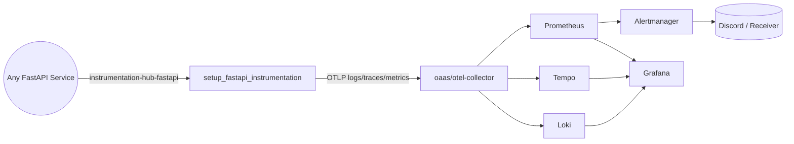

# Observability as a Service (OAAS)

- This repository hosts a standalone observability stack (Loki + Tempo + Prometheus + Alertmanager + Grafana + OpenTelemetry Collector).
- The goal is to expose observability capabilities that any backend can reuse over a shared network.
- OTEL Instrumentation is implemented by using my own [Observability Toolkit Lib](https://github.com/vyavasthita/instrumentation-hub)

---

## Stack Overview

| Component | Version | Purpose |
|-----------|---------|---------|
| OpenTelemetry Collector | 0.95.0 | Receives OTLP logs/metrics/traces from any app and fans them out to the backends |
| Grafana Loki | 2.9.4 | Log storage and querying |
| OpenSearch | 2.11.0 | Elasticsearch-compatible log storage & full-text search |
| Grafana Tempo | 2.5.0 | Trace storage |
| Jaeger all-in-one | 1.57 | Optional trace storage + UI for cross-validating spans |
| Prometheus | 2.49.1 | Metrics storage + alert rule evaluation |
| Alertmanager | 0.27.0 | Alert routing (Discord by default) |
| Grafana | 10.4.2 | Unified UI for logs, metrics, traces, and alerts |

---

## Prerequisites

- Docker Desktop / Docker Engine + Compose plugin
- Or Kubernetes Cluster

### Configure `.env`

All host-exposed ports, the shared network name, and Grafana credentials are configurable via the [`.env`](.env) file in the project root. Review and adjust any values to avoid port conflicts on your machine:

```bash
# Edit .env to change ports, e.g.:
# GRAFANA_HOST_PORT=3000
# PROMETHEUS_HOST_PORT=4091
```

| Variable | Default | Description |
|----------|---------|-------------|
| `OBSERVABILITY_NETWORK_NAME` | `oaas-observability-net` | Shared Docker network name |
| `GRAFANA_HOST_PORT` | `4001` | Grafana UI |
| `GRAFANA_ADMIN_USER` | `admin` | Grafana admin username |
| `GRAFANA_ADMIN_PASSWORD` | `admin` | Grafana admin password (change in production) |
| `PROMETHEUS_HOST_PORT` | `4002` | Prometheus UI |
| `ALERTMANAGER_HOST_PORT` | `4003` | Alertmanager UI |
| `LOKI_HOST_PORT` | `4004` | Loki API |
| `TEMPO_HOST_PORT` | `4005` | Tempo query API |
| `JAEGER_HOST_PORT` | `4006` | Jaeger UI |
| `OPENSEARCH_CORE_HOST_PORT` | `4007` | OpenSearch core (direct) |
| `OPENSEARCH_PROXY_HOST_PORT` | `4008` | OpenSearch proxy (Elasticsearch-compatible) |
| `OTEL_COLLECTOR_GRPC_HOST_PORT` | `4009` | OTEL Collector gRPC ingest |
| `OTEL_COLLECTOR_HTTP_HOST_PORT` | `4010` | OTEL Collector HTTP ingest |
| `OTEL_COLLECTOR_PROMETHEUS_HOST_PORT` | `4011` | OTEL Collector Prometheus exporter |

For AlertManager to work set discord webhook url:
```bash
export DISCORD_WEBHOOK_URL=<URL>
```
---

## Quick Start

```bash
### For Docker Compose
make build        # optional, build images without cache
make up           # creates the shared network, merges OTEL config, boots stack
make logs         # see container logs
make ps           # check container health/state

# when you are done
make stop         # stop containers but preserve volumes
make down         # stop + remove containers
make clean        # stop + remove containers and anonymous volumes

### For Kubernetes
make kup           # Start Kubernetes resources
make kdown         # Stop Kubernetes resources
```
---

## Service Onboarding Workflow

Most backend repos only need a handful of steps to start emitting telemetry into OAAS.

1. **Boot OAAS** 
  – run `make up` or `make kup` in this repo so the collector/backends and the external Docker network exist.
2. **Install Instrumentation Hub** – from your python service run one of the following:

   ```bash
   poetry add git+https://github.com/vyavasthita/instrumentation-hub.git#subdirectory=packages/python/fastapi
   # or
   pip install "instrumentation-hub-fastapi @ git+https://github.com/vyavasthita/instrumentation-hub.git@main#subdirectory=packages/python/fastapi"
   ```

3. **Wire the helper** – inside your FastAPI bootstrap file call `setup_fastapi_instrumentation(app)` and pass the OTLP endpoint env vars shown below.
4. **Join the network** – attach your container to the `observability` network alias (details in the next section).
5. **Verify in Grafana** – hit any endpoint in your service and confirm logs/metrics/traces appear in Grafana → Explore (select **Loki** or **OpenSearch Logs** for log queries).



The instrumentation helper installs FastAPI middleware, OTLP exporters, and the Prometheus endpoint so every onboarded service behaves the same way.

---

## Shared Docker Network

OAAS exposes its services over an external Docker network so other repositories can connect without sharing compose files.

1. `make up` (or `make network`) ensures the network exists. The name is set by `OBSERVABILITY_NETWORK_NAME` in [`.env`](.env).
2. In any other repo, declare the same network as external:

```yaml
networks:
  observability:
    external: true
    name: ${OBSERVABILITY_NETWORK_NAME:-oaas-observability-net}
```

   The fallback `oaas-observability-net` in the consumer repo matches the `.env` default, so it works out of the box.

3. Attach relevant services to that network and point their OTLP exporters to `http://otel-collector:4318/v1/{logs,traces,metrics}`.
   
   Because Docker DNS is shared inside the network, `otel-collector`, `loki`, `tempo`, `prometheus`, and `grafana` resolve without extra configuration.

   This separation lets you iterate on your application compose file independently while still reusing a single observability plane.

---

## OpenTelemetry Collector Strategy

The Collector remains part of this repo. Its config is built from modular YAML fragments in [observability/config/otel_collector/config](observability/config/otel_collector/config) and merged via `make otel` (automatically invoked by `make up`). Keep customizations additive:

1. Update `receivers.yaml`, `processors.yaml`, `exporters.yaml`, or `pipelines.yaml` as needed.
2. Run `make otel` to regenerate `otel-collector-config.generated.yaml`.
3. Restart the Collector (`make up` or `docker compose restart otel-collector`).

Because every client sends OTLP telemetry over the shared network, the collector stays framework-agnostic while still owning fan-out logic to Loki/Tempo/Prometheus.

---

## Service Endpoints

Ports shown below are the defaults from `.env`. Adjust as needed.

| Service | URL | `.env` Variable | Notes |
|---------|-----|-----------------|-------|
| Grafana | http://localhost:4001/ | `GRAFANA_HOST_PORT` | credentials via `GRAFANA_ADMIN_USER` / `GRAFANA_ADMIN_PASSWORD` |
| Prometheus | http://localhost:4002/ | `PROMETHEUS_HOST_PORT` | includes sample alert rule |
| Alertmanager | http://localhost:4003/ | `ALERTMANAGER_HOST_PORT` | make sure `DISCORD_WEBHOOK_URL` is set |
| Loki API | http://localhost:4004/ | `LOKI_HOST_PORT` | useful for quick readiness probes |
| Tempo | http://localhost:4005/ | `TEMPO_HOST_PORT` | provides the Tempo query API |
| Jaeger | http://localhost:4006/ | `JAEGER_HOST_PORT` | alternate traces UI + API for the jaeger backend |
| OpenSearch Core | http://localhost:4007/ | `OPENSEARCH_CORE_HOST_PORT` | direct access to OpenSearch |
| OpenSearch Proxy | http://localhost:4008/ | `OPENSEARCH_PROXY_HOST_PORT` | Elasticsearch-compatible REST API |
| OTEL Collector gRPC | localhost:4009 | `OTEL_COLLECTOR_GRPC_HOST_PORT` | gRPC OTLP ingest |
| OTEL Collector HTTP | http://localhost:4010/ | `OTEL_COLLECTOR_HTTP_HOST_PORT` | HTTP OTLP ingest |
| OTEL Collector Prometheus | http://localhost:4011/ | `OTEL_COLLECTOR_PROMETHEUS_HOST_PORT` | Prometheus exporter |

All services live on the shared Docker network, so containers from other repos can reach them at their service names.

---

## Integrating Another Repository

1. **Join the shared network** – Either add the `observability` network in your compose file (see above) or run `docker network connect` after the fact.
2. **Install instrumentation-hub-fastapi** (or the adapter for your framework) so the OTLP exporters, Prometheus reader, and HTTP metrics middleware match the stack expectations.
3. **Set OpenTelemetry env vars** in the app compose/service definition:
   - `OTEL_EXPORTER_LOGS_ENDPOINT=http://otel-collector:4318/v1/logs`
   - `OTEL_EXPORTER_TRACES_ENDPOINT=http://otel-collector:4318/v1/traces`
   - `OTEL_EXPORTER_METRICS_ENDPOINT=http://otel-collector:4318/v1/metrics`
   - `OTEL_SERVICE_NAME=<your-service>`
   - `LOGGING_BACKEND=loki` (or `opensearch`)
   - `TRACING_BACKEND=tempo` (or `jaeger`)
   - `METRICS_BACKEND=prometheus`
4. **(Optional) Additional Prometheus scrape targets** – if you still need Prometheus to scrape a metrics endpoint directly, extend [observability/config/observability_backends/prometheus/config/prometheus.yaml](observability/config/observability_backends/prometheus/config/prometheus.yaml) with another `job_name` that points to your container on the shared network.
5. **Dashboards & Alerts** – drop JSON dashboards inside [observability/config/grafana/dashboards](observability/config/grafana/dashboards) and alert rules into [observability/config/observability_backends/prometheus/config/test-alerts.yaml](observability/config/observability_backends/prometheus/config/test-alerts.yaml) (or a new file referenced from Prometheus).

> Each service chooses exactly one backend per signal (logs, traces, metrics). Running multiple services with
> different combinations is fully supported because the Collector keeps every exporter active simultaneously.

---

## Documentation

- [High-level implementation guide](observability/docs/main.md)
- [Common OpenTelemetry concepts](observability/docs/common.md)
- [Logs](observability/docs/logs.md) · [Metrics](observability/docs/metrics.md) · [Traces](observability/docs/traces.md)
- [Grafana provisioning](observability/docs/grafana.md)
- [Alerting](observability/docs/alerting.md)

Each guide has been updated to reflect the observability-as-a-service model (no coupled backend, shared network, OTLP-first ingress).

---

## Troubleshooting & Verification

1. `make ps` – confirm every container is `running (healthy)`.
2. `curl http://localhost:4004/ready` – verifies Loki readiness.
3. `curl http://localhost:4005/ready` – verifies Tempo readiness.
4. Visit Grafana and confirm Prometheus/Loki/Tempo datasources are `OK`.
5. From another repo, send a test log/trace/metric and verify it shows up in Grafana.

If a service fails, inspect logs via `make logs` (streams all containers) or `docker compose logs <service>`.

---

Named volumes (`grafana_data`, `loki_data`, `loki_wal`, `tempo_data`) remain until you delete them manually with `docker volume rm`. This keeps historical telemetry intact across restarts.

---

## References

- [OpenTelemetry Collector](https://opentelemetry.io/docs/collector/)
- [Grafana LGTM stack](https://grafana.com/oss/lgtm/)
- [Prometheus Alerting](https://prometheus.io/docs/alerting/latest/overview/)

---