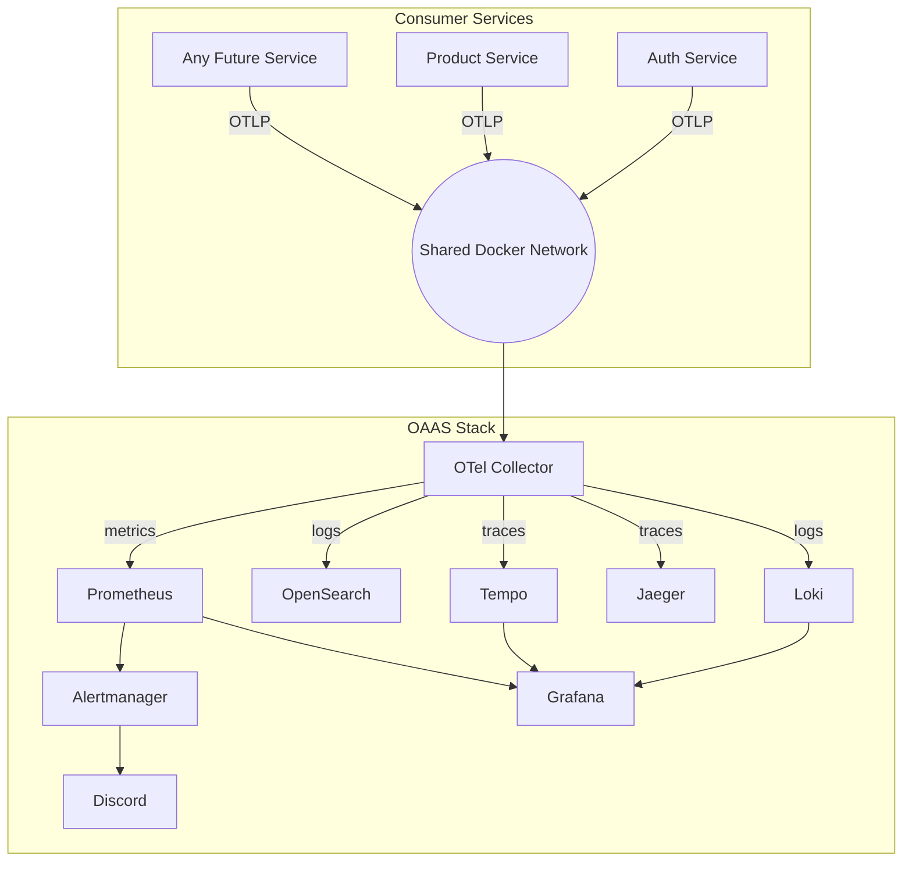

# Observability As A Service (OAAS)

<p align="left">
  
  
  
  
</p>

A **plug-and-play observability platform** 
- Any backend service gets logs, traces, metrics, dashboards, and alerting without running its own infrastructure.

### Why OAAS?

- **Zero observability code in your services.** Services connect to a shared Docker network and push OTLP — OAAS handles collection, storage, routing, and visualization.
- **Fully decoupled.** Your service knows nothing about Loki, Tempo, Prometheus, or Grafana. Swap backends (e.g. Loki → OpenSearch) without changing a single line in any consumer.
- **Per-service backend routing.** Each service declares its preferred backend via env vars (`LOGGING_BACKEND=loki`). The OTel Collector routes signals automatically — no config changes in OAAS.
- **One `docker compose up` away.** 9 production-grade components start together with health checks, persistent volumes, and pre-provisioned Grafana dashboards.
- **Reusable across any number of services.** Any microservice — each service share the same stack with full tenant isolation via `service.name`.



> Services add observability with just env vars and a shared network — **no SDKs, no config files, no infrastructure to manage.**

**Example consumer:** [Auth Service](https://github.com/vyavasthita/auth-service)

---

## Skills Demonstrated

- **Platform-as-a-product design** — 9 production-grade components (OTel Collector, Grafana, Loki, Tempo, Prometheus, Alertmanager, Jaeger, OpenSearch) are composed into a single `docker compose up` that any service can adopt with zero code changes.
- **Environment-based backend routing** — services declare `LOGGING_BACKEND=loki` or `opensearch` as an env var; the OTel Collector’s routing processor dispatches logs/traces/metrics to the correct backend without touching OAAS config.
- **Decoupled architecture** — consumer services push standard OTLP and know nothing about Grafana, Loki, or Prometheus. Swapping backends (e.g. Loki → OpenSearch) requires zero changes in any consumer.
- **Pre-provisioned Grafana** — dashboards, datasources, and alert rules are provisioned automatically via ConfigMaps, making the stack production-ready out of the box.
- **Alerting pipeline** — Prometheus → Alertmanager → Discord webhook; alert rules and routing are templated and environment-driven.
- **Shared Docker network isolation** — consumer services join an external Docker network; OAAS provides full tenant isolation via `service.name` without any multi-tenancy code.
- **OTel Collector configuration merging** — a custom shell script merges per-backend YAML fragments into a single collector config, keeping each backend’s config modular and independently testable.

---

## Stack

| Component | Purpose |
|-----------|---------|
| OTel Collector | OTLP ingest + routing |
| Loki | Log storage |
| OpenSearch | Full-text log search |
| Tempo | Trace storage |
| Jaeger | Alternate trace UI |
| Prometheus | Metrics + alerting rules |
| Alertmanager | Alert routing (Discord) |
| Grafana | Unified dashboards |

---

## Getting Started

### `.env` Configuration

Configure .env

| Variable | Default | Description |
|----------|---------|-------------|
| `OBSERVABILITY_NETWORK_NAME` | `oaas-observability-net` | Shared Docker network |
| `GRAFANA_ADMIN_USER` | `admin` | Grafana username |
| `GRAFANA_ADMIN_PASSWORD` | `admin` | Grafana password |
| `GRAFANA_HOST_PORT` | `1001` | Grafana |
| `PROMETHEUS_HOST_PORT` | `1002` | Prometheus |
| `ALERTMANAGER_HOST_PORT` | `1003` | Alertmanager |
| `LOKI_HOST_PORT` | `1004` | Loki |
| `TEMPO_HOST_PORT` | `1005` | Tempo |
| `JAEGER_HOST_PORT` | `1006` | Jaeger |
| `OPENSEARCH_CORE_HOST_PORT` | `1007` | OpenSearch (direct) |
| `OPENSEARCH_PROXY_HOST_PORT` | `1008` | OpenSearch proxy |
| `OTEL_COLLECTOR_GRPC_HOST_PORT` | `1009` | Collector gRPC |
| `OTEL_COLLECTOR_HTTP_HOST_PORT` | `1010` | Collector HTTP |
| `OTEL_COLLECTOR_PROMETHEUS_HOST_PORT` | `1011` | Collector Prometheus exporter |

For alerting: `export DISCORD_WEBHOOK_URL=<URL>`

### Option A — Dev Container (Recommended)

**Prerequisites:** VS Code, Docker Desktop, [Dev Containers extension](https://marketplace.visualstudio.com/items?itemName=ms-vscode-remote.remote-containers)

1. Clone this repo
2. Open the folder in VS Code
3. When prompted, click **Reopen in Container** (or run `Dev Containers: Reopen in Container` from the command palette)
4. All observability services start automatically
5. Access Grafana at `http://localhost:<GRAFANA_HOST_PORT>`

> No Python, Make, or other tooling needed on the host — everything runs inside containers.

### Option B — Makefile

**Prerequisites:** Docker Desktop / Docker Engine + Compose, Make

1. Clone this repo
2. Run:
   ```bash
   make up       # creates network, merges OTel config, boots stack
   make ps       # check health
   ```


### Make Commands

```bash
make up       # creates network, merges OTel config, boots stack
make ps       # check health
make logs     # follow logs
make stop     # stop (preserve volumes)
make down     # stop + remove
make clean    # stop + remove + prune volumes
```

---

## Service Endpoints

| Service | URL | Variable |
|---------|-----|----------|
| Grafana | http://localhost:1001 | `GRAFANA_HOST_PORT` |
| Prometheus | http://localhost:1002 | `PROMETHEUS_HOST_PORT` |
| Alertmanager | http://localhost:1003 | `ALERTMANAGER_HOST_PORT` |
| Loki | http://localhost:1004 | `LOKI_HOST_PORT` |
| Tempo | http://localhost:1005 | `TEMPO_HOST_PORT` |
| Jaeger | http://localhost:1006 | `JAEGER_HOST_PORT` |
| OpenSearch | http://localhost:1008 | `OPENSEARCH_PROXY_HOST_PORT` |
| OTel Collector (HTTP) | http://localhost:1010 | `OTEL_COLLECTOR_HTTP_HOST_PORT` |

---

## Integrating Another Repository

1. **Join the shared network** — add to your `docker-compose.yaml`:
   ```yaml
   networks:
     observability:
       external: true
       name: ${OBSERVABILITY_NETWORK_NAME}
   ```
   `OBSERVABILITY_NETWORK_NAME` in your `.env` must match the value in OAAS `.env`.

2. **Set env vars** in your service container. Port `4318` is the OTel Collector's container-internal HTTP port (`OTEL_COLLECTOR_HTTP_HOST_PORT` in [`.env`](.env) controls the host-side mapping):
   ```yaml
   OTEL_EXPORTER_LOGS_ENDPOINT: http://otel-collector:4318/v1/logs
   OTEL_EXPORTER_TRACES_ENDPOINT: http://otel-collector:4318/v1/traces
   OTEL_EXPORTER_METRICS_ENDPOINT: http://otel-collector:4318/v1/metrics
   OTEL_SERVICE_NAME: <your-service>
   LOGGING_BACKEND: loki          # or opensearch
   TRACING_BACKEND: tempo         # or jaeger
   METRICS_BACKEND: prometheus
   ```

3. **Install [Instrumentation Hub](https://github.com/vyavasthita/instrumentation-hub)**:
   ```bash
   poetry add git+https://github.com/vyavasthita/instrumentation-hub.git#subdirectory=packages/python/fastapi
   ```

4. **Wire it up** in your FastAPI app:
   ```python
   from instrumentation_hub_fastapi import FastAPIInstrumentation
   FastAPIInstrumentation().setup(app)
   ```


5. **Verify** — hit your service, then check Grafana Explore.

> See [Auth Service](https://github.com/vyavasthita/auth-service) for a complete working example.

---

## Documentation

- [Implementation guide](observability/docs/main.md) · [Common concepts](observability/docs/common.md)
- [Logs](observability/docs/logs.md) · [Metrics](observability/docs/metrics.md) · [Traces](observability/docs/traces.md)
- [Grafana provisioning](observability/docs/grafana.md) · [Alerting](observability/docs/alerting.md)

---

## Related Repositories

| Repository | Purpose |
|------------|---------|
| [Instrumentation Hub](https://github.com/vyavasthita/instrumentation-hub) | Client library — instruments FastAPI services with a single function call |
| [Auth Service](https://github.com/vyavasthita/auth-service) | Example consumer — JWT auth + RBAC with full OAAS integration |
| [Micro-Cart](https://github.com/vyavasthita/micro-cart) | Example consumer — e-commerce microservices with full OAAS integration |

---

## Troubleshooting

```bash
make ps                              # check container health
curl http://localhost:1004/ready     # Loki readiness
curl http://localhost:1005/ready     # Tempo readiness
make logs                            # stream all logs
```

---

## License

[MIT](LICENSE) — Copyright © 2026 Dilip Kumar Sharma.
