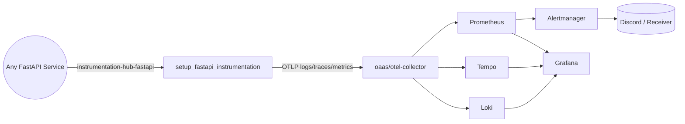

# Observability as a Service (OAAS)

This repository now hosts a standalone observability stack (Loki + Tempo + Prometheus + Alertmanager + Grafana + OpenTelemetry Collector). No application or database code lives here anymore—the goal is to expose observability capabilities that any backend can reuse over a shared Docker network.

---

## Stack Overview

| Component | Version | Purpose |
|-----------|---------|---------|
| OpenTelemetry Collector | 0.95.0 | Receives OTLP logs/metrics/traces from any app and fans them out to the backends |
| Grafana Loki | 2.9.4 | Log storage and querying |
| Grafana Tempo | 2.5.0 | Trace storage |
| Prometheus | 2.49.1 | Metrics storage + alert rule evaluation |
| Alertmanager | 0.27.0 | Alert routing (Discord by default) |
| Grafana | 10.4.2 | Unified UI for logs, metrics, traces, and alerts |

All persistent data is stored in Docker-managed volumes so this repo stays config-only.

---

## Prerequisites

- Docker Desktop / Docker Engine + Compose plugin
- GNU Make (macOS comes with 3.81; anything ≥3.81 works)
- Optional: set `OBSERVABILITY_NETWORK_NAME` if you need a custom shared network name (default: `oaas-observability-net`).
- Required: export a Discord webhook so Alertmanager can send notifications:

```bash
export DISCORD_WEBHOOK_URL="https://discord.com/api/webhooks/<id>/<token>"
```

---

## Quick Start

```bash
# from the repo root
make clean        # optional, ensures nothing stale is running
make up           # creates the shared network, merges OTEL config, boots stack
make ps           # check container health/state

# when you are done
make stop         # stop containers but preserve volumes
make down         # stop + remove containers
make clean        # stop + remove containers and anonymous volumes
```

The Make targets call `docker compose` under the hood, so you can still run `docker compose logs` or `docker compose ps` directly if you prefer.

---

## Service Onboarding Workflow

Most backend repos only need a handful of steps to start emitting telemetry into OAAS.

1. **Boot OAAS** – run `make up` in this repo so the collector/backends and the external Docker network exist.
2. **Install Instrumentation Hub** – from your FastAPI service run one of the following:

   ```bash
   poetry add git+https://github.com/vyavasthita/instrumentation-hub.git#subdirectory=packages/python/fastapi
   # or
   pip install "instrumentation-hub-fastapi @ git+https://github.com/vyavasthita/instrumentation-hub.git@main#subdirectory=packages/python/fastapi"
   ```

3. **Wire the helper** – inside your FastAPI bootstrap file call `setup_fastapi_instrumentation(app)` and pass the OTLP endpoint env vars shown below.
4. **Join the network** – attach your container to the `observability` network alias (details in the next section).
5. **Verify in Grafana** – hit any endpoint in your service and confirm logs/metrics/traces appear in Grafana → Explore.



The instrumentation helper installs FastAPI middleware, OTLP exporters, and the Prometheus endpoint so every onboarded service behaves the same way.

---

## Shared Docker Network

OAAS exposes its services over an external Docker network so other repositories can connect without sharing compose files.

1. `make up` (or `make network`) ensures the network exists. By default it is named `oaas-observability-net`.
2. In any other repo, declare the same network as external:

```yaml
networks:
  observability:
    external: true
    name: ${OBSERVABILITY_NETWORK_NAME:-oaas-observability-net}
```

3. Attach relevant services to that network and point their OTLP exporters to `http://otel-collector:4318/v1/{logs,traces,metrics}`.
Because Docker DNS is shared inside the network, `otel-collector`, `loki`, `tempo`, `prometheus`, and `grafana` resolve without extra configuration.

This separation lets you iterate on your application compose file independently while still reusing a single observability plane.

---

## OpenTelemetry Collector Strategy

The Collector remains part of this repo. Its config is built from modular YAML fragments in [observability/config/otel_collector/config](observability/config/otel_collector/config) and merged via `make otel` (automatically invoked by `make up`). Keep customizations additive:

1. Update `receivers.yaml`, `processors.yaml`, `exporters.yaml`, or `pipelines.yaml` as needed.
2. Run `make otel` to regenerate `otel-collector-config.generated.yaml`.
3. Restart the Collector (`make up` or `docker compose restart otel-collector`).

Because every client sends OTLP telemetry over the shared network, the collector stays framework-agnostic while still owning fan-out logic to Loki/Tempo/Prometheus.

---

## Service Endpoints

| Service | URL | Notes |
|---------|-----|-------|
| Grafana | http://localhost:8080/ | admin / admin (change in production) |
| Prometheus | http://localhost:9090/ | includes sample alert rule |
| Alertmanager | http://localhost:9093/ | make sure `DISCORD_WEBHOOK_URL` is set |
| Loki API | http://localhost:3100/ | useful for quick readiness probes |
| Tempo | http://localhost:3200/ | provides the Tempo query API |
| OTEL Collector | Ports 4317/4318 | gRPC/HTTP OTLP ingest endpoints |

All services live on the shared Docker network, so containers from other repos can reach them at their service names.

---

## Integrating Another Repository

1. **Join the shared network** – Either add the `observability` network in your compose file (see above) or run `docker network connect` after the fact.
2. **Install instrumentation-hub-fastapi** (or the adapter for your framework) so the OTLP exporters, Prometheus reader, and HTTP metrics middleware match the stack expectations.
3. **Set OpenTelemetry env vars** in the app compose/service definition:
   - `OTEL_EXPORTER_LOGS_ENDPOINT=http://otel-collector:4318/v1/logs`
   - `OTEL_EXPORTER_TRACES_ENDPOINT=http://otel-collector:4318/v1/traces`
   - `OTEL_EXPORTER_METRICS_ENDPOINT=http://otel-collector:4318/v1/metrics`
   - `OTEL_METRICS_EXPORTER=otlp`
   - `OTEL_SERVICE_NAME=<your-service>`
4. **(Optional) Additional Prometheus scrape targets** – if you still need Prometheus to scrape a metrics endpoint directly, extend [observability/config/observability_backends/prometheus/config/prometheus.yaml](observability/config/observability_backends/prometheus/config/prometheus.yaml) with another `job_name` that points to your container on the shared network.
5. **Dashboards & Alerts** – drop JSON dashboards inside [observability/config/grafana/dashboards](observability/config/grafana/dashboards) and alert rules into [observability/config/observability_backends/prometheus/config/test-alerts.yaml](observability/config/observability_backends/prometheus/config/test-alerts.yaml) (or a new file referenced from Prometheus).

---

## Documentation

- [High-level implementation guide](observability/docs/main.md)
- [Common OpenTelemetry concepts](observability/docs/common.md)
- [Logs](observability/docs/logs.md) · [Metrics](observability/docs/metrics.md) · [Traces](observability/docs/traces.md)
- [Grafana provisioning](observability/docs/grafana.md)
- [Alerting](observability/docs/alerting.md)

Each guide has been updated to reflect the observability-as-a-service model (no coupled backend, shared network, OTLP-first ingress).

---

## Troubleshooting & Verification

1. `make ps` – confirm every container is `running (healthy)`.
2. `curl http://localhost:3100/ready` – verifies Loki readiness.
3. `curl http://localhost:3200/ready` – verifies Tempo readiness.
4. Visit Grafana and confirm Prometheus/Loki/Tempo datasources are `OK`.
5. From another repo, send a test log/trace/metric and verify it shows up in Grafana.

If a service fails, inspect logs via `make logs` (streams all containers) or `docker compose logs <service>`.

---

## Cleaning Up

```bash
make stop   # stop containers only
make down   # stop + remove containers (keeps volumes)
make clean  # stop + remove containers and anonymous volumes
```

Named volumes (`grafana_data`, `loki_data`, `loki_wal`, `tempo_data`) remain until you delete them manually with `docker volume rm`. This keeps historical telemetry intact across restarts.

---

## References

- [OpenTelemetry Collector](https://opentelemetry.io/docs/collector/)
- [Grafana LGTM stack](https://grafana.com/oss/lgtm/)
- [Prometheus Alerting](https://prometheus.io/docs/alerting/latest/overview/)

---