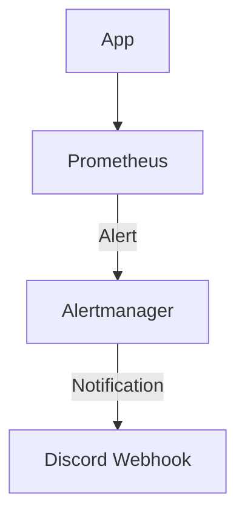
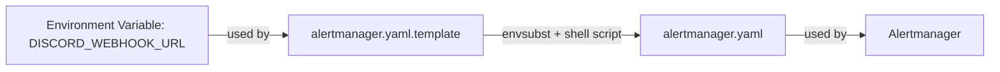

# Observability: Alerts Integration (Prometheus & Alertmanager)

This document describes how alerting is configured, triggered, and routed inside the Observability-as-a-Service stack using Prometheus and Alertmanager.

---

## Overview

Alerting provides real-time notifications about system health, errors, and performance issues. In this stack:
- Prometheus evaluates alerting rules based on metrics it scrapes.
- Alerts are sent to Alertmanager for grouping, deduplication, and routing.
- Alertmanager sends notifications to receivers (e.g., Discord, email).

---

## End-to-End Alerting Flow

1. **Metrics Collection:** Prometheus scrapes metrics from the OpenTelemetry Collector.
2. **Alert Evaluation:** Prometheus evaluates alerting rules defined in its configuration.
3. **Alert Dispatch:** When a rule is triggered, Prometheus sends the alert to Alertmanager.
4. **Alert Processing:** Alertmanager groups, deduplicates, and applies silencing/inhibition rules.
5. **Notification Routing:** Alertmanager sends notifications to configured receivers (e.g., Discord webhook, email).

---

## Alerting Block Diagram



---

## Key Components & Config Files

- **Prometheus:**
    - `prometheus.yaml`: Main config, includes `scrape_configs` and `alerting` section.
    - `test-alerts.yaml` (or similar): Contains alerting rules.
- **Alertmanager:**
    - `alertmanager.yaml.template`: Main config, defines receivers and routes.
    - `alertmanager-entrypoint.sh`: Entrypoint script for injecting secrets (e.g., Discord webhook).

---

## How Alerts Work in This Project

- Prometheus continuously evaluates alerting rules against scraped metrics.
- When a rule fires, Prometheus sends the alert to Alertmanager (e.g., `http://alertmanager:9093`).
- Alertmanager groups, deduplicates, and routes alerts to receivers (Discord, email, etc.).
- Discord notifications are sent via webhook, with the webhook URL securely injected via environment variable and entrypoint script.

---

## Config Templating for Secrets

Alertmanager does not natively support environment variable substitution in its YAML config. To securely inject secrets (like Discord webhook URLs) at runtime:
- Use a template file (`alertmanager.yaml.template`) with a placeholder (`${DISCORD_WEBHOOK_URL}`).
- At container startup, a shell script runs `envsubst` to replace the placeholder with the actual value from the environment variable, generating the final config file.
- This avoids hardcoding secrets and supports secure, dynamic configuration.



---

## Example Alerting Rule (Conceptual)
- Alert if HTTP error rate is high:
    - Prometheus rule: If more than 5% of requests are 5xx in the last 5 minutes, fire an alert.
- Alert if service is down:
    - Prometheus rule: If a target is unreachable for more than 1 minute, fire an alert.

---

## Alertmanager Routing & Notification
- Alertmanager can route alerts based on labels (e.g., severity, service).
- Supports grouping, silencing, inhibition, and deduplication.
- Receivers can be Discord, email, Slack, etc.
- Uses a template config and shell script to securely inject secrets.

---

## Docker Compose & Container Changes
- **Prometheus:**
    - Mount `prometheus.yaml` and alert rules file.
    - Expose port 9090.
- **Alertmanager:**
    - Mount `alertmanager.yaml.template` and entrypoint script.
    - Expose port 9093.
    - Set environment variable for Discord webhook.

---

## Example Directory Structure
```
observability/config/observability_backends/alertmanager/
    config/
        alertmanager.yaml.template
    scripts/
        alertmanager-entrypoint.sh
observability/docs/alerting.md
```

---

## Troubleshooting
- Ensure Prometheus and Alertmanager containers are healthy and ports are exposed.
- Check Prometheus UI for alert status and firing alerts.
- Check Alertmanager UI for alert routing and notification status.
- Verify Discord (or other receiver) notifications are received.

---

## References
- [Prometheus Alerting](https://prometheus.io/docs/alerting/latest/overview/)
- [Alertmanager Documentation](https://prometheus.io/docs/alerting/latest/alertmanager/)
- [Grafana Alerting (optional)](https://grafana.com/docs/grafana/latest/alerting/)
- [Alertmanager Configuration](https://prometheus.io/docs/alerting/latest/configuration/)
- [Discord Webhook Setup](https://support.discord.com/hc/en-us/articles/228383668-Intro-to-Webhooks)
