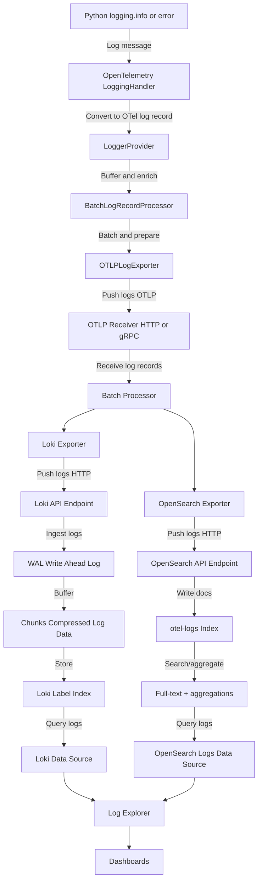

# Logging Observability: End-to-End Flow

---

> For shared OpenTelemetry and observability concepts, see [common.md](common.md).

> Examples in this document mention FastAPI because that is the sample workload we instrumented first. Every step applies to any application that can emit OTLP logs.

> FastAPI services should call `setup_fastapi_instrumentation(app)` from the `instrumentation-hub-fastapi` package so logging, tracing, and metrics stay consistent across repos.

---

## 1. Logging Flow: From App to Grafana

### What is the OpenTelemetry Log Format?

The OpenTelemetry log format is a structured, vendor-neutral format for representing log data in a way that is consistent, machine-readable, and compatible with observability pipelines. Key features:

- Each log record is a structured object (not plain text), typically serialized as JSON or Protobuf.
- Fields include:
  - Timestamp (when the log was emitted)
  - Severity (level, e.g., INFO, ERROR)
  - Body (the log message)
  - Attributes (key-value pairs for context, e.g., service name, environment, trace/span IDs)
  - Resource (describes the emitting service, e.g., service.name, service.version)
- Designed for interoperability with metrics and traces, enabling correlation across telemetry data.
- Used by OpenTelemetry SDKs, Collectors, and backends like Loki, making logs queryable and filterable by labels/attributes.

In this project, Python logs are converted to this format by the OpenTelemetry LoggingHandler before being exported.

### Step-by-Step Process

1. **Log Generation (App Service):**
   - The FastAPI backend emits logs using Python's standard logging module.
   - The OpenTelemetry LoggingHandler is attached to the root logger, so all logs are captured and formatted for OTel export.
   - **Detail:**
     - By attaching the LoggingHandler to the root logger, every log message from any part of the backend—including third-party libraries—is intercepted automatically.
     - The LoggingHandler enriches each log with metadata (such as service name and environment), ensuring logs are consistently tagged for observability.
     - Each log is converted from the standard Python log format into the OpenTelemetry log format, making it compatible with the rest of the observability pipeline.
     - This approach guarantees that all logs—regardless of their source—are:
       - Captured centrally
       - Enriched with useful context
       - Exported to the OpenTelemetry Collector for further processing
     - No changes are needed to individual log statements throughout the codebase, making the setup robust and easy to maintain.

1a. **Log Receiver and Processor (App Service):**
  - The OpenTelemetry LoggerProvider acts as the log receiver, collecting log records from the LoggingHandler.
  - The LoggerProvider is configured with a log processor (typically a BatchLogRecordProcessor) that buffers, enriches, and prepares logs for export.
  - The processor ensures logs are efficiently batched and can add resource attributes (e.g., service name, environment) to each log record.

2. **Log Export (OTLP):**
  - Our backend uses the OpenTelemetry Python SDK to automatically export logs to the OpenTelemetry Collector using the OTLP protocol (HTTP or gRPC).
  - This process is handled by the log exporter and processor configured in our application; it does not require manual API calls or endpoint invocations from our code.
  - When a log event occurs, the LoggingHandler converts it to the OpenTelemetry log format and passes it to the LoggerProvider.
  - The LoggerProvider's processor batches and prepares logs, then the OTLP log exporter sends them over HTTP or gRPC to the Collector endpoint (`OTEL_COLLECTOR_OTLP_ENDPOINT`).
  - The OTLP endpoint is specified in our logging setup (see `otel_logging_setup.py`) and must match the Collector's receiver configuration. Use the `OTEL_COLLECTOR_OTLP_ENDPOINT` placeholder above to update the endpoint in one place.
  - This export is asynchronous and efficient: our application code simply logs as usual, and the OpenTelemetry SDK handles the transmission of logs to the Collector in the background.

  **Technical Details:**
  - The LoggingHandler acts as a bridge between Python's logging system and OpenTelemetry. It intercepts log records and transforms them into OpenTelemetry log records, preserving metadata and context.
  - The LoggerProvider manages log processors. The most common processor is BatchLogRecordProcessor, which buffers logs and sends them in batches for efficiency.
  - The OTLPLogExporter serializes log records into the OpenTelemetry log format (Protobuf or JSON) and transmits them to the Collector endpoint over HTTP or gRPC (`OTEL_COLLECTOR_OTLP_ENDPOINT`).
  - The Collector's OTLP receiver listens for incoming log records and ingests them into the observability pipeline.
  - All configuration for endpoints, batching, and resource attributes is set in our `otel_logging_setup.py` and related config files.

  **Note:**
  - The OTLP endpoint (see `OTEL_COLLECTOR_OTLP_ENDPOINT` above) is **not** a typical REST API endpoint.
  - It is a protocol-specific telemetry ingestion endpoint that accepts logs, metrics, and traces in the OTLP format (Protobuf or JSON) over HTTP or gRPC.
  - The endpoint is designed for machine-to-machine communication between SDKs/agents and the Collector, not for manual REST calls or human interaction.
  - Our application does **not** call this endpoint directly; the OpenTelemetry SDK handles all communication automatically in the background.

  **Sequence Diagram:**

  ```mermaid
  sequenceDiagram
      participant App as FastAPI App
      participant LoggingHandler
      participant LoggerProvider
      participant BatchProcessor
      participant OTLPLogExporter
      participant Collector

      App->>LoggingHandler: logging.info(...)
      LoggingHandler->>LoggerProvider: Convert to OTel log record
      LoggerProvider->>BatchProcessor: Buffer log record
      BatchProcessor->>OTLPLogExporter: Batch and send log records
      OTLPLogExporter->>Collector: Transmit logs (HTTP/gRPC)
      Collector-->>OTLPLogExporter: Ack/Response
  ```

3. **Log Collection (OpenTelemetry Collector):**
  - The OpenTelemetry Collector is a standalone service (usually running as a Docker container) that acts as the central log pipeline in our observability stack.
  - Our backend's OpenTelemetry SDK exports logs to the OTLP endpoint (`OTEL_COLLECTOR_OTLP_ENDPOINT`). The Collector is configured to listen on this endpoint and passively receives incoming logs and other telemetry data.
  - The OTLP receiver in the Collector is configured in `receivers.yaml` and merged into `otel-collector-config.generated.yaml`. It can accept telemetry from any service or agent that supports OTLP.
  - Once logs are received, the Collector processes them using a batch processor (configured in `processors.yaml`). The batch processor buffers logs, applies any configured transformations or enrichments, and flushes them in batches for efficient downstream delivery.
  - The Collector can also apply additional processors for filtering, resource enrichment, or custom logic as needed.
  - After processing, the Collector exports logs to Loki using the Loki exporter (configured in `exporters.yaml`). The Loki exporter pushes logs to the Loki backend for storage and indexing.
  - In summary: Our backend (and any other OTLP-compatible service) sends logs to the Collector's OTLP endpoint; the Collector listens, processes, and exports these logs to Loki for visualization in Grafana.

4. **Log Storage (Loki & OpenSearch):**
  - The Collector's [`routing/logs` processor](../config/otel_collector/config/processors.yaml) looks at the `logging_backend` resource attribute emitted by `instrumentation-hub-fastapi`. Supported values today are `loki` and `opensearch`, so every service can pick its storage target without touching the Collector.
  - When `logging_backend=loki`, the Loki exporter sends batched OTLP records to `http://loki:3100/loki/api/v1/push`. Loki listens for HTTP POST requests, ingests them into its WAL, compresses them into chunks, and indexes labels for fast queries. All state lives inside the `loki_data` and `loki_wal` Docker volumes.
  - When `logging_backend=opensearch`, the OpenSearch exporter writes the same records to the `opensearch` container at `http://opensearch:9200`. Records land in the `otel-logs` index, which supports full-text search, field aggregations, and compatibility with Elasticsearch tooling. The container runs in single-node mode with security disabled for local development, and it persists to the `opensearch_data` volume.
  - Both exporters are "push" based. Neither Loki nor OpenSearch reach back into the Collector; they simply expose HTTP APIs and accept whatever the Collector sends.

  #### Why is there an `opensearch-proxy` container?

  The OpenTelemetry Collector uses the `elasticsearchexporter` to write documents into OpenSearch. That exporter performs a safety check before accepting a cluster as "Elasticsearch-compatible" by looking for the `X-Elastic-Product: Elasticsearch` HTTP header. Upstream OpenSearch intentionally omits that header, so the exporter refuses to ingest logs and the entire pipeline stalls.

  To stay fully compatible with the stock exporter we run a very small NGINX sidecar:

  1. `opensearch-core` continues to run the real data node on port `9201`.
  2. `opensearch-proxy` listens on port `9200`, forwards every request to `opensearch-core`, and injects the missing `X-Elastic-Product` header on the way back.
  3. The Collector, Grafana, and any human using `curl http://localhost:9200` now talk to the proxy and succeed in the capability check. No credentials, storage paths, or APIs change.

  We continue to rely on the upstream `elasticsearchexporter` because it ships with otelcol-contrib, receives regular fixes, and speaks both Elasticsearch and OpenSearch dialects. The NGINX shim is therefore the smallest possible change that keeps us on the supported exporter while unlocking the OpenSearch experience we prefer.

  You can see this behavior by running `curl -I http://localhost:9200` (note the extra response header) or by querying Grafana's OpenSearch data source, which now works without custom plugins.

5. **Log Visualization (Grafana):**
  - Grafana now ships with **two** log data sources via provisioning files under `observability/config/grafana/provisioning/datasources/`:
    - **Loki** – best for label-based queries and log/trace correlation.
    - **OpenSearch Logs** – best for free-text search or teams that already know the Elasticsearch DSL.
  - Use Grafana → Explore to choose the data source that matches the backend selected by your service. Dashboards can mix both if needed.

---

## Consolidated Block Diagram: End-to-End Log Flow

Below is a detailed block diagram showing the complete journey of a log message from your FastAPI app, through the OpenTelemetry pipeline, to Loki storage and Grafana visualization. Each component and step is annotated for clarity.



**Step-by-step explanation:**

1. **App Logging:**
  - Your FastAPI app emits logs using Python's logging module (e.g., `logging.info`).
  - The OpenTelemetry LoggingHandler is attached to the root logger, intercepting all log messages.
2. **Log Conversion & Export:**
  - LoggingHandler converts logs to OpenTelemetry log records, passing them to the LoggerProvider.
  - LoggerProvider uses a BatchLogRecordProcessor to buffer and enrich logs with resource attributes.
  - OTLPLogExporter serializes and pushes logs to the Collector's OTLP endpoint (HTTP/gRPC).
3. **Collector Processing:**
  - Collector's OTLP receiver ingests logs, applies batch processing, and uses the Loki exporter to push logs to Loki's HTTP API endpoint.
4. **Backend Storage:**
  - If a service sets `logging_backend=loki`, the collector pushes batches to Loki where they are persisted in WAL and chunk storage before indexing by labels.
  - If a service sets `logging_backend=opensearch`, the collector writes the same batches into the `otel-logs` index, unlocking full-text search and aggregations on every field.
  - Both backends persist data inside Docker volumes so it survives container restarts.
5. **Grafana Visualization:**
  - Grafana now offers two log data sources—`Loki` and `OpenSearch Logs`—so you can query whichever backend your service targets.
  - Logs can be explored, filtered, or aggregated in Explore, and any query can be promoted into a dashboard panel.

This diagram and explanation cover every major component and step in the log pipeline, from generation to visualization.

---

## Configuration Files: How Data Flows

- **Backend Logging Setup:**
  - Uses `otel_logging_setup.py` to configure OTel export and logger provider.
- **Collector Config:**
  - Modular files under `observability/config/otel_collector/config/` define receivers, processors, exporters, and pipelines.
  - These are merged into `otel-collector-config.generated.yaml` for the Collector service (auto-generated, do not edit directly).
- **Loki Config:**
  - `observability/config/observability_backends/loki/config/loki-config.yaml` sets up Loki's storage and indexing.
- **Grafana Provisioning:**
  - `observability/config/grafana/provisioning/` contains data source and dashboard configs for Grafana (Prometheus, Loki, Tempo, and OpenSearch Logs).

---

## Key Points

- All configuration is modular and separated for maintainability.
- Data directories are kept separate from config for clean operation.
- The flow is extensible: we can add metrics/traces by updating Collector config and backend setup.
- Grafana provides a single pane of glass for all observability data.

---

For more details, see the implementation checklist and config files in the `observability/config/` directory.
