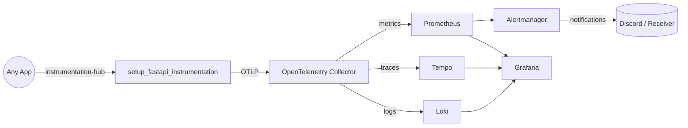

## Service Onboarding Playbook

This repository acts as "Observability as a Service" for every backend that can speak OTLP. Follow the checklist below each time a new service needs telemetry.

---

### 1. Boot OAAS

1. Run `make up` to create the shared Docker network, regenerate the Collector config, and start Loki, Tempo, Prometheus, Alertmanager, and Grafana.
2. Confirm container health with `make ps` (or `docker compose ps`).
3. Export `DISCORD_WEBHOOK_URL` before running `make up` so Alertmanager can send notifications.

All persistent data lives in Docker volumes (`grafana_data`, `loki_data`, `loki_wal`, `tempo_data`).

---

### 2. Install the Instrumentation Toolkit

For FastAPI workloads install the reusable helper directly from GitHub until packages are published to PyPI:

```bash
poetry add git+https://github.com/vyavasthita/instrumentation-hub.git#subdirectory=packages/python/fastapi
# or
pip install "instrumentation-hub-fastapi @ git+https://github.com/vyavasthita/instrumentation-hub.git@main#subdirectory=packages/python/fastapi"
```

Other frameworks can follow the same pattern (pending adapters under `packages/python/django` and `packages/node/express`).

---

### 3. Wire the Helper into Your App

```python
from fastapi import FastAPI
from instrumentation_hub_fastapi import setup_fastapi_instrumentation

app = FastAPI()
setup_fastapi_instrumentation(app)
```

Expose the OTLP endpoint env vars (`OTEL_EXPORTER_*`) in your compose/service definition. The helper attaches tracing, logging, Prometheus/OTLP metrics, and HTTP middleware in one call.

---

### 4. Join the Shared Docker Network

Add the network declaration (or run `docker network connect`):

```yaml
networks:
  observability:
    external: true
    name: ${OBSERVABILITY_NETWORK_NAME:-oaas-observability-net}
```

Attach your container to both its local network and `observability`. Docker DNS then resolves `otel-collector`, `loki`, `tempo`, `prometheus`, and `grafana` from the application container.

---

### 5. Manage the Collector Configuration

The Collector is assembled from modular YAML fragments stored in [observability/config/otel_collector/config](../config/otel_collector/config):

| File | Purpose |
|------|---------|
| `receivers.yaml` | Defines OTLP HTTP + gRPC ingress.
| `processors.yaml` | Adds batching and attribute enrichment.
| `exporters.yaml` | Targets Loki, Tempo, and the Prometheus exporter.
| `pipelines.yaml` | Wires receivers → processors → exporters per signal.

Edit the fragments, run `make otel`, and restart the collector when changes land. The generated config stays out of version control.

---

### 6. Visualize & Alert

- Grafana is pre-provisioned with Prometheus, Loki, and Tempo data sources. Drop JSON dashboards into [observability/config/grafana/dashboards](../config/grafana/dashboards) and they load automatically.
- Prometheus alert rules belong in [observability/config/observability_backends/prometheus/config/test-alerts.yaml](../config/observability_backends/prometheus/config/test-alerts.yaml) (or another referenced file).
- Alertmanager uses a templated config plus an entrypoint script so secrets live in environment variables.

See the focused docs: [logs](logs.md), [metrics](metrics.md), [traces](traces.md), [grafana](grafana.md), [alerting](alerting.md), and [common concepts](common.md).

---

### 7. End-to-End Flow



---

### 8. Verification Checklist

1. `make ps` – ensure every OAAS container is healthy.
2. From a client repo, send a test log/span/metric (invoke a FastAPI endpoint, emit a sample log, etc.).
3. Query Loki/Tempo/Prometheus in Grafana → Explore to confirm ingestion.
4. Trigger the sample alert in `test-alerts.yaml` to verify Alertmanager + Discord wiring.

Once these steps pass, the OAAS stack is ready for broader service onboarding.
