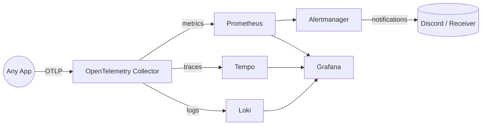

## Observability Implementation Steps (OAAS)

This repository now acts as “Observability as a Service”. The checklist below explains how any application—FastAPI, Flask, Spring Boot, Go, etc.—can plug into the shared stack without duplicating observability infrastructure.

---

### 1. Bring Up the Stack

1. `make up` – Creates the shared Docker network, regenerates the OpenTelemetry Collector config, and starts Loki, Tempo, Prometheus, Alertmanager, and Grafana.
2. Confirm service health with `make ps` (or `docker compose ps`).
3. Export `DISCORD_WEBHOOK_URL` before running `make up` so Alertmanager can route alerts.

All persistent data lives in Docker volumes (`grafana_data`, `loki_data`, `loki_wal`, `tempo_data`). No host `data/` directory is required anymore.

---

### 2. Join the Shared Network from Your App Repo

Add this snippet to the other repo’s `docker-compose.yaml`:

```yaml
networks:
  observability:
    external: true
    name: ${OBSERVABILITY_NETWORK_NAME:-oaas-observability-net}
```

Attach whichever services should emit telemetry:

```yaml
services:
  api:
    image: ghcr.io/example/api:latest
    networks:
      - observability
    environment:
      OTEL_SERVICE_NAME: api
      OTEL_EXPORTER_LOGS_ENDPOINT: http://otel-collector:4318/v1/logs
      OTEL_EXPORTER_TRACES_ENDPOINT: http://otel-collector:4318/v1/traces
      OTEL_EXPORTER_METRICS_ENDPOINT: http://otel-collector:4318/v1/metrics
      OTEL_METRICS_EXPORTER: otlp
```

Once both compose projects are running, Docker DNS makes `otel-collector`, `loki`, `tempo`, etc. resolvable from the application containers.

---

### 3. Instrument the Application

1. Install the OpenTelemetry SDK + relevant auto-instrumentation packages for your language/framework.
2. Configure log, trace, and metric exporters to point at the Collector endpoints shown above.
3. (Optional) Keep Prometheus-style `/metrics` endpoints if you still want direct scraping. You can add dedicated scrape jobs in [observability/config/observability_backends/prometheus/config/prometheus.yaml](../config/observability_backends/prometheus/config/prometheus.yaml).

The OTLP receiver is protocol-agnostic, so any OTEL-compatible SDK will work.

---

### 4. Maintain the Collector Configuration

The Collector is assembled from modular YAML fragments stored in [observability/config/otel_collector/config](../config/otel_collector/config):

| File | Purpose |
|------|---------|
| `receivers.yaml` | Defines OTLP ingestion (HTTP + gRPC). |
| `processors.yaml` | Adds batching + attribute enrichment. |
| `exporters.yaml` | Targets Loki, Tempo, and the Prometheus exporter. |
| `pipelines.yaml` | Wires receivers → processors → exporters per signal. |

Edit the fragments, run `make otel`, and restart the collector if you need extra processors or exporters. The generated file (`otel-collector-config.generated.yaml`) stays out of version control.

---

### 5. Visualize & Alert

- Grafana is pre-provisioned with Prometheus, Loki, and Tempo data sources. Drop JSON dashboards into [observability/config/grafana/dashboards](../config/grafana/dashboards) and they load automatically on startup.
- Prometheus alert rules live in [observability/config/observability_backends/prometheus/config/test-alerts.yaml](../config/observability_backends/prometheus/config/test-alerts.yaml) (feel free to add more files and reference them in `prometheus.yaml`).
- Alertmanager uses a templated config plus a small entrypoint script so secrets stay in environment variables.

See the dedicated docs for deeper dives: [logs](logs.md), [metrics](metrics.md), [traces](traces.md), [grafana](grafana.md), [alerting](alerting.md), and [common OpenTelemetry concepts](common.md).

---

### 6. High-Level Flow

1. Client services push OTLP telemetry over HTTP/gRPC to `otel-collector` on the shared network.
2. The Collector enriches and fans out signals:
   - Logs → Loki
   - Traces → Tempo
   - Metrics → Prometheus exporter (scraped by Prometheus)
3. Prometheus ships alerts to Alertmanager, which forwards them to Discord (or any receiver you configure).
4. Grafana provides the single UI for all three signals + alert status.



---

### 7. Verification Checklist

1. `make ps` – ensure every service is running/healthy.
2. From a client repo, send a test log/span/metric.
3. Query Loki/Tempo/Prometheus in Grafana to confirm ingestion.
4. Trigger a sample alert (see `test-alerts.yaml`) to verify Alertmanager + Discord wiring.

Once these are green, the OAAS stack is ready to service additional applications.
