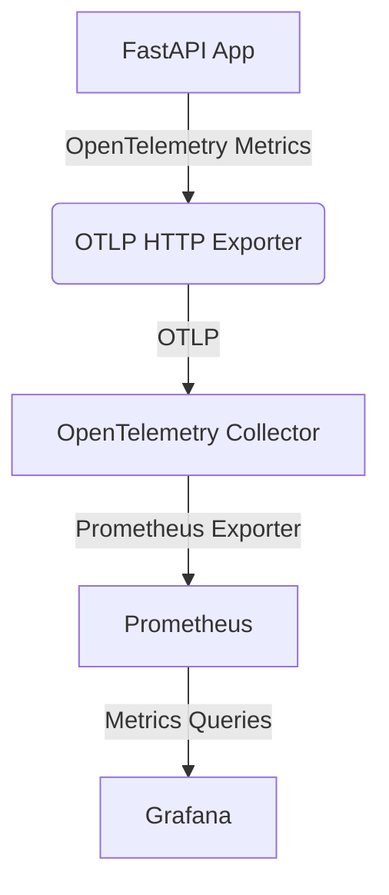
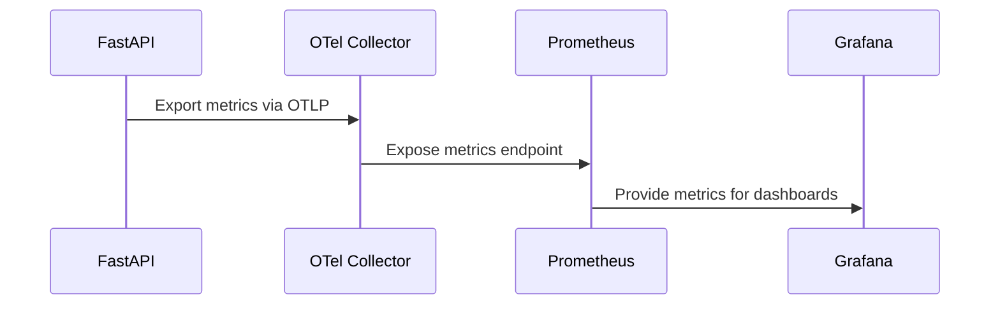
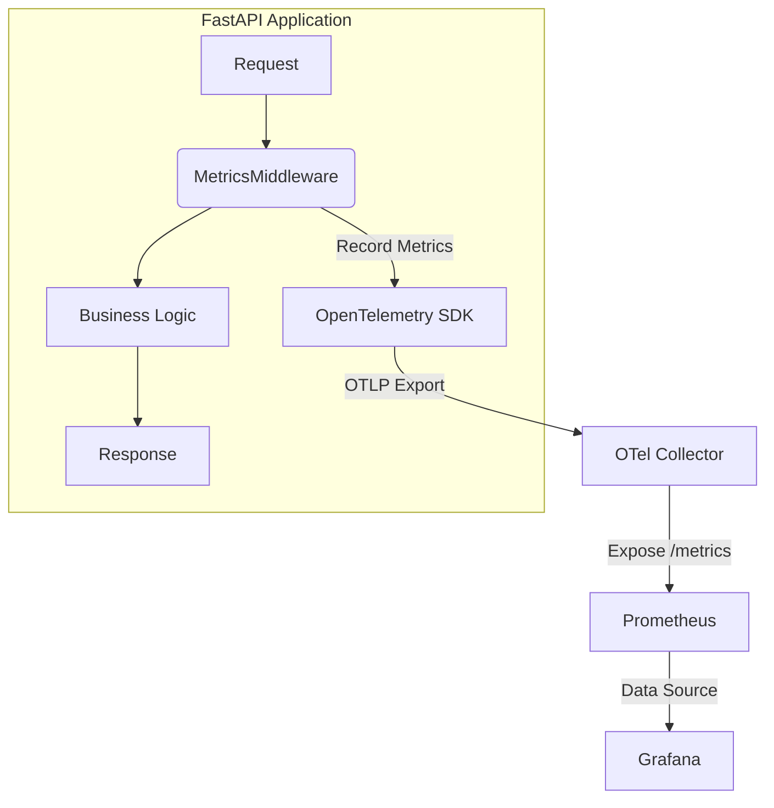

# Metrics Observability: End-to-End Flow

---

> For shared OpenTelemetry and observability concepts, see [common.md](common.md).

> FastAPI is used in examples below, but the same pattern works for any workload that can emit OTLP metrics.

> Use the `instrumentation-hub-fastapi` helper to attach OTLP + Prometheus exports with a single call (`setup_fastapi_instrumentation(app)`).

---

## Overview

Metrics provide quantitative data about application performance, resource usage, and business KPIs. In this stack, metrics are:
- Instrumented in FastAPI using OpenTelemetry
- Exported via OTLP to the OpenTelemetry Collector
- Scraped and stored by Prometheus
- Visualized in Grafana

---

## Architecture Diagram

---

## Step-by-Step Integration

### 1. Docker Compose
- Add the Prometheus service with config mounts (data lives in Docker volumes by default).
- Expose port 9090 for Prometheus UI.

### 2. Backend Instrumentation
- Install opentelemetry-instrumentation-prometheus and prometheus-client.
- Use OpenTelemetry SDK to instrument FastAPI for metrics.
- Export metrics via OTLP to the Collector.

### 3. OpenTelemetry Collector
- Add metrics pipeline in modular config:
  - receivers.yaml: Enable OTLP receiver for metrics
  - processors.yaml: Add batch/metrics processor
  - exporters.yaml: Add prometheus exporter
  - pipelines.yaml: Wire metrics pipeline

### 4. Prometheus Config
- prometheus.yaml scrapes metrics from Collector and backend (if needed).

### 5. Grafana Integration
- Add Prometheus as a data source in Grafana.
- Build dashboards to visualize metrics.

---

## End-to-End Flow

---

## Custom Metrics Instrumentation (FastAPI example)

### Why Instrument HTTP Metrics?
By default, application-level HTTP metrics (such as request count, duration, and error rates) are not exposed to Prometheus. To enable observability for these, you must instrument your FastAPI app to collect and export them.

### Steps to Add Custom Metrics Instrumentation
1. **Add Middleware for Metrics**
   - Implement a custom middleware (e.g., `MetricsMiddleware`) to intercept HTTP requests and record metrics such as request count and duration.
   - Attach labels like `method`, `path`, and `status_code` for granular analysis.
2. **Register the Middleware**
   - Add the middleware to your FastAPI app so all requests are automatically instrumented.
3. **Create Metric Instruments**
   - Use OpenTelemetry's Meter API to create counters and histograms for your desired metrics.
4. **Export Metrics**
   - Configure the OpenTelemetry SDK to export metrics to the OpenTelemetry Collector using OTLP.
5. **Collector and Prometheus Integration**
   - Ensure the Collector is set up to receive OTLP metrics and expose them via a Prometheus-compatible endpoint.
6. **Prometheus Scraping**
   - Prometheus scrapes the Collector's `/metrics` endpoint to ingest your application's metrics.
7. **Grafana Visualization**
   - Build dashboards in Grafana using Prometheus as the data source.

---

### Configuration and Container Changes for Each Step (Summary)

- **FastAPI App (Backend):**
  - Set environment variables in docker-compose (e.g., OTEL_EXPORTER_METRICS_ENDPOINT, OTEL_METRICS_EXPORTER).
  - No config file, just environment variables.

- **OpenTelemetry Collector:**
  - Main config: `otel-collector-config.yaml` (or similar, in `observability/config/otel_collector/config/`)
  - Expose ports 4318 (OTLP HTTP) and 8889 (Prometheus exporter) in docker-compose.

- **Prometheus:**
  - Main config: `prometheus.yaml` (in `observability/config/observability_backends/prometheus/config/`)
  - Expose port 9090 in docker-compose.

- **Grafana:**
  - Data source provisioning: `datasources.yaml` (in `observability/config/grafana/provisioning/datasources/`)
  - Dashboard provisioning: `dashboard.yaml` (in `observability/config/grafana/provisioning/dashboards/`)
  - Dashboard JSONs: (in `observability/config/grafana/dashboards/`)
  - Expose port 3000 (or mapped port) in docker-compose.

> Adjust file names and paths as needed for your environment. These are the essential config files and container changes for end-to-end metrics observability.

> For shared concepts and pipeline details, see [common.md](common.md).

## Middleware Role in Instrumentation
- The custom `MetricsMiddleware` is responsible for:
  - Counting every HTTP request.
  - Measuring request duration.
  - Attaching relevant labels (method, path, status_code).
- This ensures all HTTP traffic is measured, regardless of route or handler.

---

## Metrics Instrumentation Flow

---

## End-to-End Metrics Flow: FastAPI to Prometheus

1. **Request Handling**: Every HTTP request passes through the custom middleware.
2. **Metrics Recording**: Middleware records metrics (count, duration, labels) using OpenTelemetry.
3. **Metrics Export**: OpenTelemetry SDK exports metrics to the OTel Collector via OTLP.
4. **Collector Exposure**: OTel Collector exposes a `/metrics` endpoint in Prometheus format.
5. **Prometheus Scraping**: Prometheus scrapes the Collector's `/metrics` endpoint at regular intervals.
6. **Visualization**: Grafana queries Prometheus to visualize and analyze metrics.

---

## About the /metrics Endpoint
- The `/metrics` endpoint is not natively available in FastAPI.
- It is exposed by the OpenTelemetry Collector, not the FastAPI app itself.
- The Collector receives metrics from the app (via OTLP), aggregates them, and exposes them at `/metrics` for Prometheus to scrape.
- **Flow:**
  - FastAPI app → OTel Collector (OTLP) → Collector `/metrics` endpoint → Prometheus → Grafana

---

## OTLP vs Prometheus Endpoints in the OTel Collector

When instrumenting metrics in a FastAPI app with OpenTelemetry, it is important to understand the different endpoints and ports involved in the metrics pipeline:

- **OTLP HTTP Endpoint (Port 4318):**
  - The FastAPI app exports metrics to the OTel Collector using the OTLP protocol over HTTP.
  - The standard port for OTLP HTTP is `4318`.
  - Example endpoint: `http://otel-collector:4318/v1/metrics`
  - This is configured in the backend with the `OTEL_EXPORTER_METRICS_ENDPOINT` environment variable.
  - The FastAPI app does not expose metrics directly to Prometheus; it only pushes metrics to the collector via this OTLP endpoint.

- **Prometheus Exporter Endpoint (Port 8889):**
  - The OTel Collector exposes a Prometheus-compatible `/metrics` endpoint on a different port, typically `8889`.
  - Prometheus is configured to scrape this endpoint, not the OTLP endpoint.
  - Example scrape config in Prometheus: `http://otel-collector:8889/metrics`
  - The Prometheus exporter in the collector translates OTLP metrics into Prometheus format for scraping.

- **Key Points:**
  - Prometheus does **not** scrape OTLP endpoints directly; it only scrapes the Prometheus exporter endpoint.
  - Port `4318` is for OTLP ingestion (metrics sent from FastAPI to the collector).
  - Port `8889` is for Prometheus scraping (metrics pulled from the collector by Prometheus).
  - The FastAPI app never exposes a `/metrics` endpoint directly; all metrics flow through the OTel Collector.

### Example Flow

1. FastAPI app exports metrics to the OTel Collector at `http://otel-collector:4318/v1/metrics` (OTLP HTTP).
2. OTel Collector receives and processes metrics.
3. OTel Collector exposes metrics at `http://otel-collector:8889/metrics` (Prometheus format).
4. Prometheus scrapes the collector's `/metrics` endpoint on port `8889`.
5. Grafana visualizes metrics from Prometheus.

---

## Important Notes
- **Default Instrumentation**: FastAPI and OpenTelemetry do not expose HTTP metrics to Prometheus by default. You must add custom instrumentation (middleware) for this.
- **Labeling**: Always use meaningful labels (method, path, status_code) for better filtering and aggregation in dashboards.
- **Collector Configuration**: Ensure the Collector is configured with an OTLP receiver and Prometheus exporter.
- **Prometheus Scrape Config**: Prometheus must be configured to scrape the Collector's `/metrics` endpoint, not the FastAPI app directly.
- **Testing**: After setup, trigger requests and verify metrics appear in Prometheus and Grafana.
- **Extensibility**: You can add more custom metrics (e.g., business KPIs) using the same pattern.

---

## Troubleshooting
- Ensure OTEL_EXPORTER_METRICS_ENDPOINT and OTEL_METRICS_EXPORTER are set in backend environment.
- Confirm Prometheus can scrape the Collector's metrics endpoint.
- Check Grafana data source configuration for Prometheus.

---

## References
- [OpenTelemetry Python Metrics](https://opentelemetry.io/docs/instrumentation/python/metrics/)
- [Prometheus Documentation](https://prometheus.io/docs/introduction/overview/)
- [Grafana Documentation](https://grafana.com/docs/grafana/latest/)

---