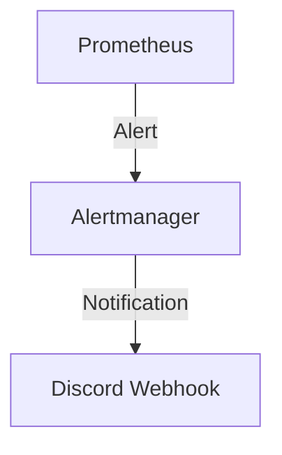
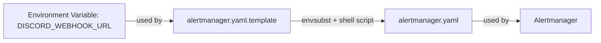

# Alerting Integration: Prometheus + Alertmanager + Discord

## Overview
Prometheus monitors your application and infrastructure, evaluating alerting rules. When a rule triggers, Prometheus sends the alert to Alertmanager. Alertmanager groups, deduplicates, and routes alerts to configured receivers (e.g., Discord, email, Slack).

## How Alerting Works
1. **Prometheus** evaluates alerting rules and sends alerts to Alertmanager.
2. **Alertmanager** receives alerts, applies grouping/routing logic, and sends notifications to receivers.
3. **Discord** receives notifications via webhook.

### Mermaid Diagram: Alert Flow


## Configuration Details
- **Prometheus**: `alerting > alertmanagers` points to Alertmanager service.
- **Alertmanager**: Uses a YAML config to define receivers and routing.
- **Discord**: Configured as a webhook receiver in Alertmanager.

### Why Use a Template File and Shell Script?
Alertmanager does not natively support environment variable substitution in its YAML config. To securely inject secrets (like Discord webhook URLs) at runtime:
- We use a template file (`alertmanager.yaml.template`) with a placeholder (`${DISCORD_WEBHOOK_URL}`).
- At container startup, a shell script runs `envsubst` to replace the placeholder with the actual value from the environment variable, generating the final config file.
- This avoids hardcoding secrets and supports secure, dynamic configuration.

#### Mermaid Diagram: Config Templating


## Step-by-Step Setup
1. **Create alertmanager.yaml.template** with `${DISCORD_WEBHOOK_URL}` placeholder.
2. **Write a shell script** to run `envsubst` and start Alertmanager.
3. **Set the environment variable** on the host before starting Docker Compose:
   ```bash
   export DISCORD_WEBHOOK_URL="https://discord.com/api/webhooks/your_webhook_id/your_webhook_token"
   ```
4. **Docker Compose** mounts the template and script, sets the entrypoint to the script.
5. **On container startup**, the script generates the final config and launches Alertmanager.

## Example Directory Structure
```
observability/config/observability_backends/alertmanager/
    config/
        alertmanager.yaml.template
    scripts/
        alertmanager-entrypoint.sh
observability/docs/observability-alerting.md
```

## References
- [Prometheus Alerting docs](https://prometheus.io/docs/alerting/latest/alertmanager/)
- [Alertmanager Configuration](https://prometheus.io/docs/alerting/latest/configuration/)
- [Discord Webhook Setup](https://support.discord.com/hc/en-us/articles/228383668-Intro-to-Webhooks)
