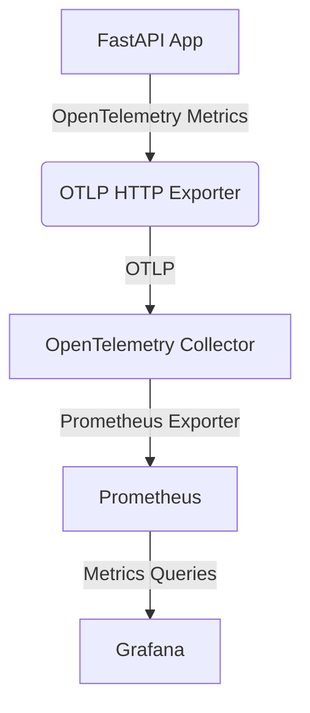
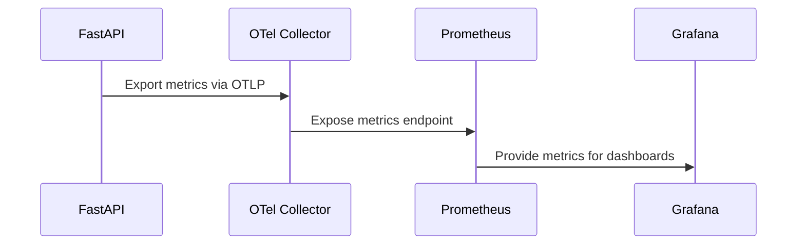

# Metrics Observability: End-to-End Flow

---

> For shared OpenTelemetry and observability concepts, see [observability-common.md](observability-common.md).

---

# For shared OpenTelemetry and observability concepts, see [observability-common.md](observability-common.md).
# Observability: Metrics Integration (Prometheus)

This document describes how metrics are instrumented, collected, and visualized in the Tic-Tac-Toe FastAPI project using OpenTelemetry, Prometheus, and Grafana.

---

## Overview

Metrics provide quantitative data about application performance, resource usage, and business KPIs. In this stack, metrics are:
- Instrumented in FastAPI using OpenTelemetry
- Exported via OTLP to the OpenTelemetry Collector
- Scraped and stored by Prometheus
- Visualized in Grafana

---

## Architecture Diagram



---

## Directory Structure

```
observability/
  config/
    observability_backends/
      prometheus/
        config/
          prometheus.yaml
    otel_collector/
      config/
        receivers.yaml
        processors.yaml
        exporters.yaml
        pipelines.yaml
  docs/
    observability-metrics.md
```

---

## Step-by-Step Integration

### 1. Docker Compose
- Add Prometheus service with config and data mounts.
- Expose port 9090 for Prometheus UI.

### 2. Backend Instrumentation
- Install opentelemetry-instrumentation-prometheus and prometheus-client.
- Use OpenTelemetry SDK to instrument FastAPI for metrics.
- Export metrics via OTLP to the Collector.

### 3. OpenTelemetry Collector
- Add metrics pipeline in modular config:
  - receivers.yaml: Enable OTLP receiver for metrics
  - processors.yaml: Add batch/metrics processor
  - exporters.yaml: Add prometheus exporter
  - pipelines.yaml: Wire metrics pipeline

### 4. Prometheus Config
- prometheus.yaml scrapes metrics from Collector and backend (if needed).

### 5. Grafana Integration
- Add Prometheus as a data source in Grafana.
- Build dashboards to visualize metrics.

---

## Example Prometheus Scrape Config

```yaml
global:
  scrape_interval: 15s
scrape_configs:
  - job_name: 'otel-collector'
    static_configs:
      - targets: ['otel-collector:8889']
```

---

## Example FastAPI Metrics Setup

```python
from opentelemetry.sdk.metrics import MeterProvider
from opentelemetry.exporter.otlp.proto.http.metric_exporter import OTLPMetricExporter
from opentelemetry.sdk.metrics.export import PeriodicExportingMetricReader
from opentelemetry.instrumentation.fastapi import FastAPIInstrumentor
from opentelemetry.sdk.resources import SERVICE_NAME, Resource

app = FastAPI()

resource = Resource(attributes={SERVICE_NAME: "tic-tac-toe-backend"})
exporter = OTLPMetricExporter(endpoint="http://otel-collector:4318/v1/metrics")
reader = PeriodicExportingMetricReader(exporter)
provider = MeterProvider(resource=resource, metric_readers=[reader])
FastAPIInstrumentor().instrument_app(app, meter_provider=provider)
```

---

## End-to-End Flow



---

## Troubleshooting
- Ensure OTEL_EXPORTER_METRICS_ENDPOINT and OTEL_METRICS_EXPORTER are set in backend environment.
- Confirm Prometheus can scrape the Collector's metrics endpoint.
- Check Grafana data source configuration for Prometheus.

---

## References
- [OpenTelemetry Python Metrics](https://opentelemetry.io/docs/instrumentation/python/metrics/)
- [Prometheus Documentation](https://prometheus.io/docs/introduction/overview/)
- [Grafana Documentation](https://grafana.com/docs/grafana/latest/)
