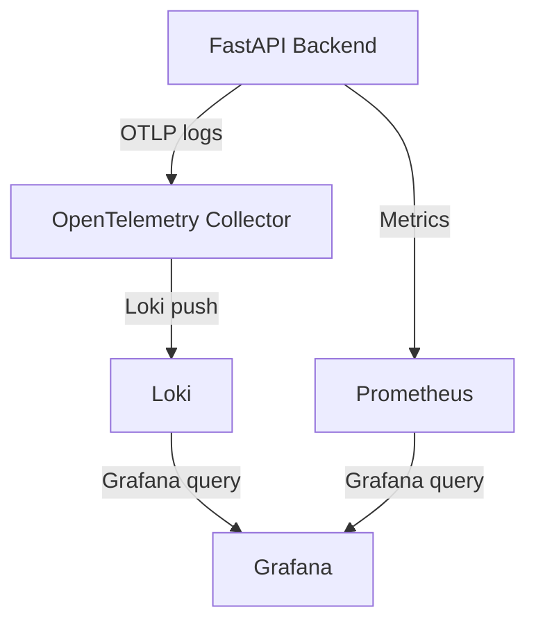

# How Observability Works in This Project

---

**OTLP Endpoint:**
`OTEL_COLLECTOR_OTLP_ENDPOINT = http://otel-collector:4318`


This document explains the end-to-end flow of logging observability in our FastAPI backend, including the roles of OpenTelemetry Collector, Loki, Prometheus, and Grafana, and how configuration files drive the process.

---


## Protocols Used in the Log Pipeline: OTLP vs REST

### Push vs Pull: How Data Moves from App to Loki

For each step in the log pipeline, the mechanism is as follows:

| Step                              | Mechanism | Who initiates?         |
|-----------------------------------|-----------|------------------------|
| App → OTEL Collector              | Push      | App (OTLP exporter)    |
| OTEL Collector → Loki             | Push      | Collector (Loki exporter) |
| Loki Storage                      | Passive   | Loki only receives     |

- **Push:** The sender initiates the connection and transmits data to the receiver.
- **Pull:** The receiver requests or fetches data from the sender (not used in this pipeline).
- **Passive:** Loki does not initiate any connection; it only listens for incoming data.

**Summary:**
- All steps from app to Loki are push-based. There is no pull mechanism anywhere in this log pipeline. Each component actively sends (pushes) data to the next, and Loki passively receives logs via its HTTP API endpoint.
### Why OTLP Instead of a Generic REST API?

While REST APIs are vendor-agnostic and widely used, OTLP (OpenTelemetry Protocol) is chosen for app-to-Collector communication because:

1. **Purpose-built for Telemetry:**
  - OTLP defines a strict, efficient, and standardized data model and serialization (Protobuf or JSON) for logs, metrics, and traces.
  - This ensures compatibility, performance, and semantic consistency across all OpenTelemetry-compatible tools and vendors.

2. **Optimized for Observability:**
  - REST APIs are generic and do not define how to represent telemetry data, nor do they support batching, compression, or streaming as efficiently as OTLP.
  - OTLP supports both HTTP and gRPC transports, enabling high-throughput, low-latency, and bi-directional streaming—features important for observability pipelines.

3. **Interoperability and Future-proofing:**
  - Using OTLP ensures seamless interoperability between SDKs, Collectors, and backends, with no need for custom mapping or translation.
  - It is designed to evolve with the observability ecosystem, supporting new telemetry types and features as they emerge.

**Summary:**

- OTLP is not just a transport (like REST), but a full protocol and data model for observability, designed for performance, interoperability, and future-proofing.
- REST is generic and flexible, but lacks the telemetry-specific features and guarantees that OTLP provides.
- That’s why OpenTelemetry uses OTLP for all agent/collector communication, not a generic REST API.

**Why do we use OTLP from the app to the Collector, but HTTP REST from the Collector to Loki?**

- **App → OTEL Collector:**
  - The OpenTelemetry SDK in the app uses the OTLP protocol (OpenTelemetry Protocol) to export logs, metrics, and traces.
  - OTLP is a vendor-neutral, efficient protocol designed specifically for telemetry data. It supports both HTTP and gRPC transports, but the payload is in OTLP format (Protobuf or JSON), not a typical REST API.
  - The Collector's OTLP receiver is designed to accept this protocol and format.

- **OTEL Collector → Loki:**
  - Loki does **not** natively support OTLP. Instead, it exposes a REST API endpoint (`/loki/api/v1/push`) for log ingestion.
  - The OTEL Collector's Loki exporter converts log data into the format Loki expects and sends it via HTTP POST to this REST endpoint.
  - This is a push-based integration: the Collector acts as a client, and Loki passively receives logs.

**Summary Table:**

| Step                        | Protocol         | Data Format         | Direction         |
|-----------------------------|------------------|---------------------|-------------------|
| App → OTEL Collector        | OTLP (HTTP/gRPC) | OTLP (Protobuf/JSON)| Push (SDK → Collector) |
| OTEL Collector → Loki       | HTTP REST        | Loki JSON           | Push (Collector → Loki) |

This design is required because each component supports different protocols for log ingestion. The Collector acts as a bridge, translating from OTLP to the format Loki expects.

---
## 1. Logging Flow: From App to Grafana


### What is the OpenTelemetry Log Format?

The OpenTelemetry log format is a structured, vendor-neutral format for representing log data in a way that is consistent, machine-readable, and compatible with observability pipelines. Key features:

- Each log record is a structured object (not plain text), typically serialized as JSON or Protobuf.
- Fields include:
  - Timestamp (when the log was emitted)
  - Severity (level, e.g., INFO, ERROR)
  - Body (the log message)
  - Attributes (key-value pairs for context, e.g., service name, environment, trace/span IDs)
  - Resource (describes the emitting service, e.g., service.name, service.version)
- Designed for interoperability with metrics and traces, enabling correlation across telemetry data.
- Used by OpenTelemetry SDKs, Collectors, and backends like Loki, making logs queryable and filterable by labels/attributes.

In this project, Python logs are converted to this format by the OpenTelemetry LoggingHandler before being exported.

### Step-by-Step Process

1. **Log Generation (App Service):**
   - The FastAPI backend emits logs using Python's standard logging module.
   - The OpenTelemetry LoggingHandler is attached to the root logger, so all logs are captured and formatted for OTel export.
   - **Detail:**
     - By attaching the LoggingHandler to the root logger, every log message from any part of the backend—including third-party libraries—is intercepted automatically.
     - The LoggingHandler enriches each log with metadata (such as service name and environment), ensuring logs are consistently tagged for observability.
     - Each log is converted from the standard Python log format into the OpenTelemetry log format, making it compatible with the rest of the observability pipeline.
     - This approach guarantees that all logs—regardless of their source—are:
       - Captured centrally
       - Enriched with useful context
       - Exported to the OpenTelemetry Collector for further processing
     - No changes are needed to individual log statements throughout the codebase, making the setup robust and easy to maintain.

1a. **Log Receiver and Processor (App Service):**
  - The OpenTelemetry LoggerProvider acts as the log receiver, collecting log records from the LoggingHandler.
  - The LoggerProvider is configured with a log processor (typically a BatchLogRecordProcessor) that buffers, enriches, and prepares logs for export.
  - The processor ensures logs are efficiently batched and can add resource attributes (e.g., service name, environment) to each log record.

2. **Log Export (OTLP):**
  - Our backend uses the OpenTelemetry Python SDK to automatically export logs to the OpenTelemetry Collector using the OTLP protocol (HTTP or gRPC).
  - This process is handled by the log exporter and processor configured in our application; it does not require manual API calls or endpoint invocations from our code.
  - When a log event occurs, the LoggingHandler converts it to the OpenTelemetry log format and passes it to the LoggerProvider.
  - The LoggerProvider's processor batches and prepares logs, then the OTLP log exporter sends them over HTTP or gRPC to the Collector endpoint (`OTEL_COLLECTOR_OTLP_ENDPOINT`).
  - The OTLP endpoint is specified in our logging setup (see `otel_logging_setup.py`) and must match the Collector's receiver configuration. Use the `OTEL_COLLECTOR_OTLP_ENDPOINT` placeholder above to update the endpoint in one place.
  - This export is asynchronous and efficient: our application code simply logs as usual, and the OpenTelemetry SDK handles the transmission of logs to the Collector in the background.


  **Technical Details:**
  - The LoggingHandler acts as a bridge between Python's logging system and OpenTelemetry. It intercepts log records and transforms them into OpenTelemetry log records, preserving metadata and context.
  - The LoggerProvider manages log processors. The most common processor is BatchLogRecordProcessor, which buffers logs and sends them in batches for efficiency.
  - The OTLPLogExporter serializes log records into the OpenTelemetry log format (Protobuf or JSON) and transmits them to the Collector endpoint over HTTP or gRPC (`OTEL_COLLECTOR_OTLP_ENDPOINT`).
  - The Collector's OTLP receiver listens for incoming log records and ingests them into the observability pipeline.
  - All configuration for endpoints, batching, and resource attributes is set in our `otel_logging_setup.py` and related config files.


  **Note:**
  - The OTLP endpoint (see `OTEL_COLLECTOR_OTLP_ENDPOINT` above) is **not** a typical REST API endpoint.
  - It is a protocol-specific telemetry ingestion endpoint that accepts logs, metrics, and traces in the OTLP format (Protobuf or JSON) over HTTP or gRPC.
  - The endpoint is designed for machine-to-machine communication between SDKs/agents and the Collector, not for manual REST calls or human interaction.
  - Our application does **not** call this endpoint directly; the OpenTelemetry SDK handles all communication automatically in the background.

  **Sequence Diagram:**

  ```mermaid
  sequenceDiagram
      participant App as FastAPI App
      participant LoggingHandler
      participant LoggerProvider
      participant BatchProcessor
      participant OTLPLogExporter
      participant Collector

      App->>LoggingHandler: logging.info(...)
      LoggingHandler->>LoggerProvider: Convert to OTel log record
      LoggerProvider->>BatchProcessor: Buffer log record
      BatchProcessor->>OTLPLogExporter: Batch and send log records
      OTLPLogExporter->>Collector: Transmit logs (HTTP/gRPC)
      Collector-->>OTLPLogExporter: Ack/Response
  ```


3. **Log Collection (OpenTelemetry Collector):**
  - The OpenTelemetry Collector is a standalone service (usually running as a Docker container) that acts as the central log pipeline in our observability stack.
  - Our backend's OpenTelemetry SDK exports logs to the OTLP endpoint (`OTEL_COLLECTOR_OTLP_ENDPOINT`). The Collector is configured to listen on this endpoint and passively receives incoming logs and other telemetry data.
  - The OTLP receiver in the Collector is configured in `receivers.yaml` and merged into `otel-collector-config.yaml`. It can accept telemetry from any service or agent that supports OTLP.
  - Once logs are received, the Collector processes them using a batch processor (configured in `processors.yaml`). The batch processor buffers logs, applies any configured transformations or enrichments, and flushes them in batches for efficient downstream delivery.
  - The Collector can also apply additional processors for filtering, resource enrichment, or custom logic as needed.
  - After processing, the Collector exports logs to Loki using the Loki exporter (configured in `exporters.yaml`). The Loki exporter pushes logs to the Loki backend for storage and indexing.
  - In summary: Our backend (and any other OTLP-compatible service) sends logs to the Collector's OTLP endpoint; the Collector listens, processes, and exports these logs to Loki for visualization in Grafana.


4. **Log Storage (Loki):**
  - Loki is a log aggregation and storage backend. It is typically run as a Docker container in our stack.
  - The OTEL Collector does not store logs itself; instead, it pushes logs to Loki using the Loki exporter. The exporter sends logs directly to Loki's HTTP API endpoint.
  - **Passive Reception Explained:**
    - Loki does not initiate any connection to the Collector or "pull" logs. Instead, it exposes an HTTP API endpoint (e.g., `/loki/api/v1/push`) and simply waits for incoming log data.
    - The OTEL Collector, acting as a client, actively sends ("pushes") logs to Loki's endpoint whenever logs are ready for export.
    - Loki's role is passive: it listens for HTTP POST requests containing log data, ingests the received logs, and stores them internally.
    - This means Loki is always ready to accept logs, but it never requests or fetches them itself.
  - **Network Flow Diagram:**
    ```mermaid
    sequenceDiagram
        participant Collector as OTEL Collector
        participant Loki as Loki (HTTP API)
        Note over Collector: Collector prepares batched logs
        Collector->>Loki: HTTP POST /loki/api/v1/push (log batch)
        Loki-->>Collector: HTTP 204 No Content (acknowledge)
        Note over Loki: Loki ingests and stores logs
    ```
  - Once logs are received, Loki stores them in its internal storage engine, which consists of:
    - **WAL (Write-Ahead Log):** Temporary buffer for incoming logs before they are processed and chunked.
    - **Chunks:** Compressed log data stored for efficient querying and retrieval.
    - **Index:** Metadata for fast searching and filtering by labels.
  - In our setup, Loki's storage is mapped to the `data/loki/` directory (e.g., `../data/loki/wal` for WAL files). This directory contains all persistent log data and indexes.
  - Loki does not "call" the Collector or any endpoint to fetch logs; it passively receives logs pushed to it by the Collector and other clients.
  - In summary: The OTEL Collector pushes logs to Loki's API endpoint, and Loki stores, indexes, and makes them available for querying and visualization in Grafana. All log data is stored in the mapped `data/loki/` directory on disk.

5. **Log Visualization (Grafana):**

  ---

  ## Consolidated Block Diagram: End-to-End Log Flow

  Below is a detailed block diagram showing the complete journey of a log message from your FastAPI app, through the OpenTelemetry pipeline, to Loki storage and Grafana visualization. Each component and step is annotated for clarity.

  ```mermaid
  flowchart TD
    subgraph App[FastAPI Backend]
      A1[Python logging.info / logging.error]
      A2[OpenTelemetry LoggingHandler]
      A3[LoggerProvider]
      A4[BatchLogRecordProcessor]
      A5[OTLPLogExporter]
    end

    subgraph Collector[OpenTelemetry Collector]
      B1[OTLP Receiver (HTTP/gRPC)]
      B2[Batch Processor]
      B3[Loki Exporter]
    end

    subgraph Loki[Loki Backend]
      C1[HTTP API Endpoint /loki/api/v1/push]
      C2[WAL (Write-Ahead Log)]
      C3[Chunks (Compressed Log Data)]
      C4[Index (Label Metadata)]
      C5[Mapped Storage: data/loki/]
    end

    subgraph Grafana[Grafana UI]
      D1[Loki Data Source]
      D2[Log Explorer]
      D3[Dashboards]
    end

    %% App log flow
    A1 -->|Log message| A2
    A2 -->|Convert to OTel log record| A3
    A3 -->|Buffer & enrich| A4
    A4 -->|Batch & prepare| A5
    A5 -->|Push logs (OTLP HTTP/gRPC)| B1

    %% Collector processing
    B1 -->|Receive log records| B2
    B2 -->|Batch & process| B3
    B3 -->|Push logs (HTTP POST)| C1

    %% Loki storage
    C1 -->|Ingest logs| C2
    C2 -->|Buffer| C3
    C3 -->|Store| C4
    C4 -->|Index| C5

    %% Grafana visualization
    C5 -->|Query logs| D1
    D1 -->|Label filter/search| D2
    D2 -->|Build dashboards| D3

    %% Annotations
    classDef step fill:#f9f,stroke:#333,stroke-width:2px;
    class A2,A3,A4,A5,B1,B2,B3,C1,C2,C3,C4,C5,D1,D2,D3 step;
  ```

  **Step-by-step explanation:**

  1. **App Logging:**
    - Your FastAPI app emits logs using Python's logging module (e.g., `logging.info`).
    - The OpenTelemetry LoggingHandler is attached to the root logger, intercepting all log messages.
  2. **Log Conversion & Export:**
    - LoggingHandler converts logs to OpenTelemetry log records, passing them to the LoggerProvider.
    - LoggerProvider uses a BatchLogRecordProcessor to buffer and enrich logs with resource attributes.
    - OTLPLogExporter serializes and pushes logs to the Collector's OTLP endpoint (HTTP/gRPC).
  3. **Collector Processing:**
    - Collector's OTLP receiver ingests logs, applies batch processing, and uses the Loki exporter to push logs to Loki's HTTP API endpoint.
  4. **Loki Storage:**
    - Loki receives logs via HTTP POST, buffers them in WAL, compresses into chunks, and indexes by labels.
    - All persistent log data is stored in the mapped `data/loki/` directory.
  5. **Grafana Visualization:**
    - Grafana is provisioned to use Loki as a data source.
    - Logs can be explored, filtered by labels, and visualized in dashboards for monitoring and troubleshooting.

  This diagram and explanation cover every major component and step in the log pipeline, from generation to visualization.

---

## 2. Configuration Files: How Data Flows

- **Backend Logging Setup:**
  - Uses `otel_logging_setup.py` to configure OTel export and logger provider.
- **Collector Config:**
  - Modular files under `observability/config/otel_collector/config/` define receivers, processors, exporters, and pipelines.
  - These are merged into `otel-collector-config.yaml` for the Collector service.
- **Loki Config:**
  - `observability/config/observability_backends/loki/config/loki-config.yaml` sets up Loki's storage and indexing.
- **Grafana Provisioning:**
  - `observability/config/grafana/provisioning/` contains data source and dashboard configs for Grafana.

---

## 3. Roles of Each Component

- **OpenTelemetry Collector:**
  - Central pipeline for receiving, processing, and exporting logs.
  - Modular config allows future extension for metrics and traces.

- **Loki:**
  - Log aggregation and storage.
  - Efficient querying and indexing by labels.

- **Prometheus:**
  - (Optional for logging) Used for metrics collection and scraping.
  - Can be integrated for backend/app metrics and Grafana dashboards.

- **Grafana:**
  - Visualization and exploration of logs and metrics.
  - Unified UI for observability data.

---

## 4. Summary Diagram



---

## 5. Key Points

- All configuration is modular and separated for maintainability.
- Data directories are kept separate from config for clean operation.
- The flow is extensible: we can add metrics/traces by updating Collector config and backend setup.
- Grafana provides a single pane of glass for all observability data.

---

For more details, see the implementation checklist and config files in the `observability/config/` directory.
