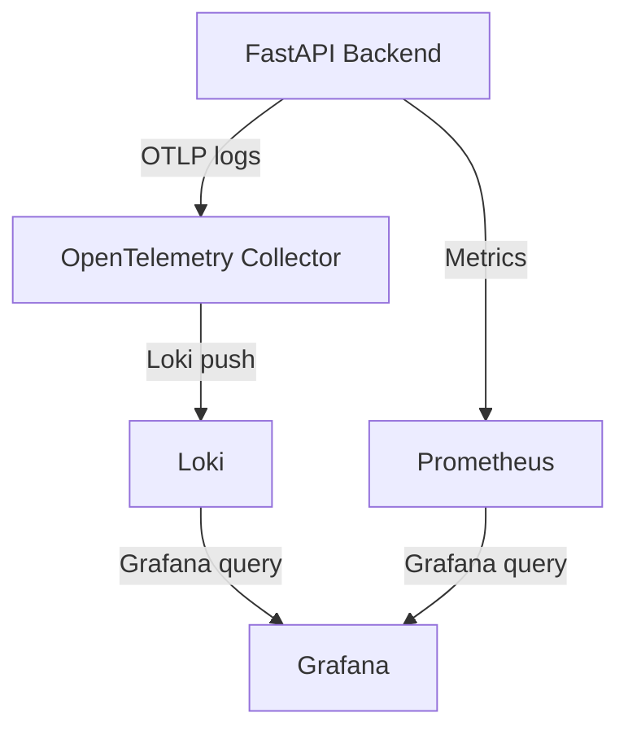

# How Observability Works in This Project

This document explains the end-to-end flow of logging observability in our FastAPI backend, including the roles of OpenTelemetry Collector, Loki, Prometheus, and Grafana, and how configuration files drive the process.

---

## 1. Logging Flow: From App to Grafana

### What is the OpenTelemetry Log Format?

The OpenTelemetry log format is a structured, vendor-neutral format for representing log data in a way that is consistent, machine-readable, and compatible with observability pipelines. Key features:

- Each log record is a structured object (not plain text), typically serialized as JSON or Protobuf.
- Fields include:
  - Timestamp (when the log was emitted)
  - Severity (level, e.g., INFO, ERROR)
  - Body (the log message)
  - Attributes (key-value pairs for context, e.g., service name, environment, trace/span IDs)
  - Resource (describes the emitting service, e.g., service.name, service.version)
- Designed for interoperability with metrics and traces, enabling correlation across telemetry data.
- Used by OpenTelemetry SDKs, Collectors, and backends like Loki, making logs queryable and filterable by labels/attributes.

In this project, Python logs are converted to this format by the OpenTelemetry LoggingHandler before being exported.

### Step-by-Step Process

1. **Log Generation (App Service):**
   - The FastAPI backend emits logs using Python's standard logging module.
   - The OpenTelemetry LoggingHandler is attached to the root logger, so all logs are captured and formatted for OTel export.
   - **Detail:**
     - By attaching the LoggingHandler to the root logger, every log message from any part of the backend—including third-party libraries—is intercepted automatically.
     - The LoggingHandler enriches each log with metadata (such as service name and environment), ensuring logs are consistently tagged for observability.
     - Each log is converted from the standard Python log format into the OpenTelemetry log format, making it compatible with the rest of the observability pipeline.
     - This approach guarantees that all logs—regardless of their source—are:
       - Captured centrally
       - Enriched with useful context
       - Exported to the OpenTelemetry Collector for further processing
     - No changes are needed to individual log statements throughout the codebase, making the setup robust and easy to maintain.

2. **Log Export (OTLP):**
   - The backend uses the OpenTelemetry Python SDK to export logs via the OTLP protocol (HTTP or gRPC) to the OpenTelemetry Collector endpoint (`otel-collector:4318`).
   - The OTLP endpoint is defined in the backend's logging setup and matches the Collector's receiver config.

3. **Log Collection (OpenTelemetry Collector):**
   - The Collector receives logs from the backend using its OTLP receiver (configured in `receivers.yaml` and merged into `otel-collector-config.yaml`).
   - The Collector processes logs using a batch processor (configured in `processors.yaml`), which buffers and flushes logs for efficient delivery.
   - The Collector exports logs to Loki using the Loki exporter (configured in `exporters.yaml`).

4. **Log Storage (Loki):**
   - Loki receives logs from the Collector and stores them in its internal database (WAL, chunks, index) under the `data/loki/` directory.
   - Loki indexes logs by labels and makes them available for querying.

5. **Log Visualization (Grafana):**
   - Grafana is configured to use Loki as a data source (via provisioning files in `observability/config/grafana/provisioning/datasources/`).
   - We can explore logs in Grafana, filter by labels, and build dashboards for monitoring and troubleshooting.

---

## 2. Configuration Files: How Data Flows

- **Backend Logging Setup:**
  - Uses `otel_logging_setup.py` to configure OTel export and logger provider.
- **Collector Config:**
  - Modular files under `observability/config/otel_collector/config/` define receivers, processors, exporters, and pipelines.
  - These are merged into `otel-collector-config.yaml` for the Collector service.
- **Loki Config:**
  - `observability/config/observability_backends/loki/config/loki-config.yaml` sets up Loki's storage and indexing.
- **Grafana Provisioning:**
  - `observability/config/grafana/provisioning/` contains data source and dashboard configs for Grafana.

---

## 3. Roles of Each Component

- **OpenTelemetry Collector:**
  - Central pipeline for receiving, processing, and exporting logs.
  - Modular config allows future extension for metrics and traces.

- **Loki:**
  - Log aggregation and storage.
  - Efficient querying and indexing by labels.

- **Prometheus:**
  - (Optional for logging) Used for metrics collection and scraping.
  - Can be integrated for backend/app metrics and Grafana dashboards.

- **Grafana:**
  - Visualization and exploration of logs and metrics.
  - Unified UI for observability data.

---

## 4. Summary Diagram

---

## 5. Key Points

- All configuration is modular and separated for maintainability.
- Data directories are kept separate from config for clean operation.
- The flow is extensible: we can add metrics/traces by updating Collector config and backend setup.
- Grafana provides a single pane of glass for all observability data.

---

For more details, see the implementation checklist and config files in the `observability/config/` directory.
