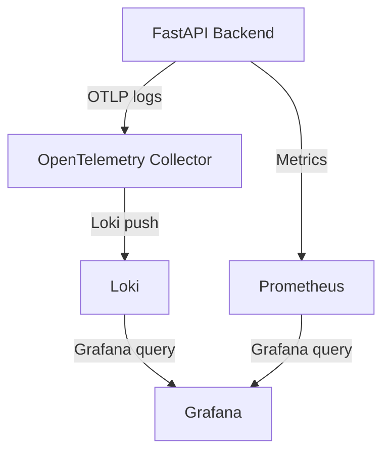

# How Observability Works in This Project

This document explains the end-to-end flow of logging observability in our FastAPI backend, including the roles of OpenTelemetry Collector, Loki, Prometheus, and Grafana, and how configuration files drive the process.

---

## 1. Logging Flow: From App to Grafana

### Step-by-Step Process

1. **Log Generation (App Service):**
   - The FastAPI backend emits logs using Python's standard logging module.
   - The OpenTelemetry LoggingHandler is attached to the root logger, so all logs are captured and formatted for OTel export.

2. **Log Export (OTLP):**
   - The backend uses the OpenTelemetry Python SDK to export logs via the OTLP protocol (HTTP or gRPC) to the OpenTelemetry Collector endpoint (`otel-collector:4318`).
   - The OTLP endpoint is defined in the backend's logging setup and matches the Collector's receiver config.

3. **Log Collection (OpenTelemetry Collector):**
   - The Collector receives logs from the backend using its OTLP receiver (configured in `receivers.yaml` and merged into `otel-collector-config.yaml`).
   - The Collector processes logs using a batch processor (configured in `processors.yaml`), which buffers and flushes logs for efficient delivery.
   - The Collector exports logs to Loki using the Loki exporter (configured in `exporters.yaml`).

4. **Log Storage (Loki):**
   - Loki receives logs from the Collector and stores them in its internal database (WAL, chunks, index) under the `data/loki/` directory.
   - Loki indexes logs by labels and makes them available for querying.

5. **Log Visualization (Grafana):**
   - Grafana is configured to use Loki as a data source (via provisioning files in `observability/config/grafana/provisioning/datasources/`).
   - We can explore logs in Grafana, filter by labels, and build dashboards for monitoring and troubleshooting.

---

## 2. Configuration Files: How Data Flows

- **Backend Logging Setup:**
  - Uses `otel_logging_setup.py` to configure OTel export and logger provider.
- **Collector Config:**
  - Modular files under `observability/config/otel_collector/config/` define receivers, processors, exporters, and pipelines.
  - These are merged into `otel-collector-config.yaml` for the Collector service.
- **Loki Config:**
  - `observability/config/observability_backends/loki/config/loki-config.yaml` sets up Loki's storage and indexing.
- **Grafana Provisioning:**
  - `observability/config/grafana/provisioning/` contains data source and dashboard configs for Grafana.

---

## 3. Roles of Each Component

- **OpenTelemetry Collector:**
  - Central pipeline for receiving, processing, and exporting logs.
  - Modular config allows future extension for metrics and traces.

- **Loki:**
  - Log aggregation and storage.
  - Efficient querying and indexing by labels.

- **Prometheus:**
  - (Optional for logging) Used for metrics collection and scraping.
  - Can be integrated for backend/app metrics and Grafana dashboards.

- **Grafana:**
  - Visualization and exploration of logs and metrics.
  - Unified UI for observability data.

---

## 4. Summary Diagram

---

## 5. Key Points

- All configuration is modular and separated for maintainability.
- Data directories are kept separate from config for clean operation.
- The flow is extensible: we can add metrics/traces by updating Collector config and backend setup.
- Grafana provides a single pane of glass for all observability data.

---

For more details, see the implementation checklist and config files in the `observability/config/` directory.
