## Observability Implementation Steps

This section summarizes the essential steps to enable observability (logging, metrics, tracing) in a Python/FastAPI project. Use this as a checklist to replicate observability in other repositories.

---

### 1. Docker Compose: Observability Services

#### 1.1 Grafana

#### 1.2 Loki

#### 1.3 General

#### 1.3 Prometheus
- Add Prometheus for metrics aggregation and storage.
- Mount prometheus.yaml config.
- Expose required port (9090).

#### 1.4 General
- For each service, only add environment variables and volumes needed for logging, metrics, or traces (avoid unrelated config here).

### 2. Backend Logging

#### 2.1 Logging Module
- Implement a centralized logging module in your backend (e.g., `observability/logging.py`).

---

### 6. OpenTelemetry Collector: Modular Log Pipeline

  - `receivers.yaml`: How logs are received (OTLP)
  - `processors.yaml`: Processing steps (batch)
  - `exporters.yaml`: Where logs are sent (Loki)
  - `pipelines.yaml`: Ties receivers, processors, and exporters
    - `otel-collector-config.generated.yaml`: Main config (auto-generated by merging the above, do not edit directly)

### 7. OpenTelemetry Collector: Modular Metrics Pipeline

- The OpenTelemetry Collector is configured with a metrics pipeline in addition to logs and traces.
- Modular config files:
    receivers.yaml: Enable OTLP receiver for metrics
    processors.yaml: Add batch/metrics processor
    exporters.yaml: Add prometheus exporter
    pipelines.yaml: Add metrics pipeline wiring
- Prometheus scrapes metrics from the Collector's prometheus exporter endpoint.

### 8. FastAPI Metrics Instrumentation

- Install opentelemetry-instrumentation-prometheus and prometheus-client in backend.
- Instrument FastAPI app for metrics using OpenTelemetry and Prometheus integration.
- Set OTEL_EXPORTER_METRICS_ENDPOINT and OTEL_METRICS_EXPORTER env variables in docker-compose.yaml.
- Metrics are exported via OTLP to the Collector, then to Prometheus.

---

### How Observability Works in This Project

---

This document explains the end-to-end flow of logging observability in our FastAPI backend, including the roles of OpenTelemetry Collector, Loki, Prometheus, and Grafana, and how configuration files drive the process.

---

**OTLP Endpoints:**

- `OTEL_EXPORTER_LOGS_ENDPOINT = http://otel-collector:4318/v1/logs`
- `OTEL_EXPORTER_TRACES_ENDPOINT = http://otel-collector:4318/v1/traces`
- `OTEL_EXPORTER_METRICS_ENDPOINT = http://otel-collector:4318/v1/metrics`

---

### Protocols Used in the Log Pipeline: OTLP vs REST

##### This file has been split for clarity and maintainability.

- For common OpenTelemetry and observability concepts, see: [observability-common.md](observability-common.md)

- For logging-specific observability details, see: [observability-logs.md](observability-logs.md)

- For traces-specific observability details, see: [observability-traces.md](observability-traces.md)

- For metrics-specific observability details, see: [observability-metrics.md](observability-metrics.md)

- For alerting-specific observability details, see: [observability-alerting.md](observability-alerting.md)

- For grafana-specific observability details, see: [observability-grafana.md](observability-grafana.md)

## Consolidated Observability Block Diagram

```mermaid
%% Style blocks for color distinction
%% Instrumentation (parent): light blue
%% Logging Instrumentation: light yellow
%% Tracing Instrumentation: light pink
%% Metrics Instrumentation: light green
%% Observability Pipeline (parent): light gray
%% Logging Pipeline: light orange
%% Tracing Pipeline: light red
%% Metrics Pipeline: light teal

flowchart LR
    %% Place FastAPI_Instrumentation left of Instrumentation
    FastAPI_Instrumentation -.-> Instrumentation

        subgraph FastAPI_Instrumentation["FastAPI Instrumentation"]
            fastapi_app["FastAPI App"]
            fastapi_logging["Logging Middleware / Instrumentation"]
            fastapi_tracing["Tracing Middleware / Instrumentation"]
            fastapi_metrics["Metrics Middleware / Instrumentation"]
        end
        fastapi_app --> fastapi_logging
        fastapi_app --> fastapi_tracing
        fastapi_app --> fastapi_metrics
        fastapi_logging -- Logs --> logging_formatter
        fastapi_tracing -- Traces --> trace_formatter
        fastapi_metrics -- Metrics --> metrics_formatter

        subgraph Instrumentation
            app["App"]

            subgraph "Logging Instrumentation"
                logging_formatter["LoggingFormatter"]
                logging_provider["LoggingProvider"]
                logs["Logs"]
            end

            subgraph "Tracing Instrumentation"
                trace_formatter["TraceFormatter"]
                tracer_provider["TracerProvider"]
                traces["Traces"]
            end

            dummy_gap[" "]

            subgraph "Metrics Instrumentation"
                metrics_formatter["MetricsFormatter"]
                meter_provider["MeterProvider"]
                metrics["Metrics"]
            end
        end

        subgraph Observability_Pipeline
            subgraph "Logging Pipeline"
                collector["OpenTelemetry Collector"]
                loki_wal["Loki WAL"]
                loki["Loki"]
                loki_endpoint["Loki Endpoint\nhttp://loki:3100/loki/api/v1/push"]
            end
            subgraph "Tracing Pipeline"
                tempo_wal["Tempo WAL"]
                tempo["Tempo"]
                tempo_endpoint["Tempo Endpoint\nhttp://tempo:4317"]
            end
            subgraph "Metrics Pipeline"
                prom_remote_write["Prometheus Remote Write"]
                prom["Prometheus"]
                prom_endpoint["Prometheus Endpoint\nhttp://prometheus:9090/api/v1/write"]
            end
            subgraph "Alerting Pipeline"
                alertmanager["Alertmanager"]
                notification_receiver["Notification Receiver\n(e.g., Email, Slack, Discord)"]
                alertmanager_endpoint["Alertmanager Endpoint\nhttp://alertmanager:9093"]
            end
        end

 
        subgraph Visualization
            grafana["Grafana"]
        end

    %% Style for the new Visualization block
    style Visualization fill:#f3e5f5,stroke:#8e24aa,stroke-width:2px



%% Style parent blocks
    style Instrumentation fill:#e3f2fd,stroke:#2196f3,stroke-width:2px
    style Observability_Pipeline fill:#ececec,stroke:#757575,stroke-width:2px
    style Visualization fill:#f3e5f5,stroke:#8e24aa,stroke-width:2px

    %% Force horizontal alignment of main blocks
    Instrumentation -.-> Observability_Pipeline -.-> Visualization

    %% Logging, Tracing, Metrics Flows (merged OTLP)
    app --> logging_formatter --> logging_provider --> logs
    app --> trace_formatter --> tracer_provider --> traces
    app --> metrics_formatter --> meter_provider --> metrics
    logs --|push|--> otlp_merge
    traces --|push|--> otlp_merge
    metrics --|push|--> otlp_merge
    otlp_merge(("<b>OTLP</b>")) --|push|--> collector
    collector --> loki_wal --> loki --|push|--> loki_endpoint
    collector --> tempo_wal --> tempo --|push|--> tempo_endpoint
    collector --> prom_remote_write --> prom --|push|--> prom_endpoint
    loki_endpoint --> pull_merge
    tempo_endpoint --> pull_merge
    prom_endpoint --> pull_merge
    pull_merge(("<b>pull</b>")) --> grafana

    %% Alerting flow
    prom -- Alert --> alertmanager -- Notification --> notification_receiver
    prom --> prom_endpoint
    alertmanager --|push|--> alertmanager_endpoint

%% FastAPI Instrumentation Flows
        subgraph FastAPI_Instrumentation["FastAPI Instrumentation"]
            fastapi_app["FastAPI App"]
            fastapi_logging["Logging Middleware / Instrumentation"]
            fastapi_tracing["Tracing Middleware / Instrumentation"]
            fastapi_metrics["Metrics Middleware / Instrumentation"]
        end
        fastapi_app --> fastapi_logging
        fastapi_app --> fastapi_tracing
        fastapi_app --> fastapi_metrics
        fastapi_logging -- Logs --> logging_formatter
        fastapi_tracing -- Traces --> trace_formatter
        fastapi_metrics -- Metrics --> metrics_formatter
```

---

### Key Points

- All configuration is modular and separated for maintainability.
- Data directories are kept separate from config for clean operation.
- The flow is extensible: we can add metrics/traces by updating Collector config and backend setup.
- Grafana provides a single pane of glass for all observability data.

---

### Protocols and Endpoints

- **OTLP Protocol:**  
    All logs, traces, and metrics are exported from the app to the OpenTelemetry Collector using the OTLP (OpenTelemetry Protocol) over HTTP.

- **Loki Endpoint:**  
    The Collector forwards logs to Loki via its HTTP API endpoint (e.g., `http://loki:3100/loki/api/v1/push`).

- **Tempo Endpoint:**  
    Traces are sent from the Collector to Tempo using the OTLP or Jaeger/Zipkin compatible endpoint (e.g., `http://tempo:4317`).

- **Prometheus Endpoint:**  
    Metrics are exposed by the Collector for Prometheus to scrape, or sent via remote_write to (e.g., `http://prometheus:9090/api/v1/write`).

For more details, see the implementation checklist and config files in the `observability/config/` directory.

---

### 1.5 Alertmanager
- Add Alertmanager for alert routing and notification management.
- Mount alertmanager.yaml.template config and entrypoint script.
- Expose required port (9093).
- Default UI: [http://localhost:9093](http://localhost:9093)

---

## How Alerts Work in This Project

See [observability-alerts.md](observability-alerts.md) for complete details on alerting, alert flow, configuration, and troubleshooting.

---

### Protocols and Endpoints

- **OTLP Protocol:**  All logs, traces, and metrics are exported from the app to the OpenTelemetry Collector using the OTLP (OpenTelemetry Protocol) over HTTP.
- **Loki Endpoint:**  The Collector forwards logs to Loki via its HTTP API endpoint (e.g., `http://loki:3100/loki/api/v1/push`).
- **Tempo Endpoint:**  Traces are sent from the Collector to Tempo using the OTLP or Jaeger/Zipkin compatible endpoint (e.g., `http://tempo:4317`).
- **Prometheus Endpoint:**  Metrics are exposed by the Collector for Prometheus to scrape, or sent via remote_write to (e.g., `http://prometheus:9090/api/v1/write`).
- **Alertmanager Endpoint:**  Alerts are sent from Prometheus to Alertmanager (e.g., `http://alertmanager:9093`).

---

### Key Points (Updated)
- All configuration is modular and separated for maintainability.
- Data directories are kept separate from config for clean operation.
- The flow is extensible: we can add metrics/traces/alerts by updating Collector config and backend setup.
- Grafana provides a single pane of glass for all observability data.
- Alertmanager uses a template config and shell script for secure environment variable injection (Discord webhook).

---

For more details, see the implementation checklist and config files in the `observability/config/` directory.
