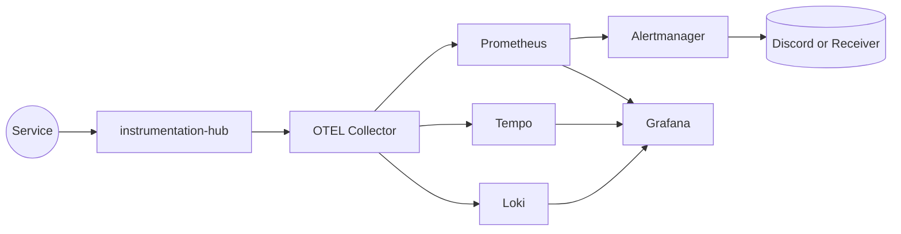

## Observability Implementation (Mirror)

This page is retained for older bookmarks. The full onboarding checklist, commands, and diagrams now live in [main.md](main.md).

### TL;DR

1. Run `make up` in this repo to boot Loki, Tempo, Prometheus, Alertmanager, and Grafana plus the `oaas-observability-net` network.
2. Install the instrumentation helper (for example `instrumentation-hub-fastapi`) in every backend and point its OTLP exporters at `http://otel-collector:4318/v1/{logs,traces,metrics}`.
3. Join the shared docker network from each service’s compose file so `otel-collector`/`loki`/`tempo` resolve over Docker DNS.
4. Keep dashboards, alert rules, and collector config inside this repository so the observability plane stays centralized.

For deeper dives (logs, metrics, traces, Grafana provisioning, alerting) follow the links in [main.md](main.md).
