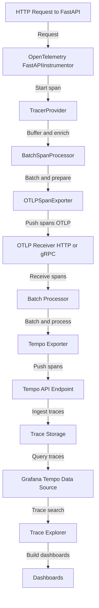

# Tracing Observability: End-to-End Flow

---

> For shared OpenTelemetry and observability concepts, see [common.md](common.md).

> FastAPI is referenced below purely as a sample workload. Any OTLP-capable service can follow the same flow.

> Recommended: use `instrumentation-hub-fastapi` and call `setup_fastapi_instrumentation(app)` so traces/logs/metrics travel together with identical resource attributes.

---

## 1. Tracing Flow: From App to Grafana

### What is the OpenTelemetry Trace Format?

The OpenTelemetry trace format is a vendor-neutral, structured format for representing distributed traces. Key features:

- Each trace consists of one or more spans (units of work), each with:
  - trace_id (unique per trace)
  - span_id (unique per span)
  - parent_span_id (for hierarchy)
  - name, start/end time, status, attributes, events
- Resource attributes (e.g., service.name) describe the emitting service.
- Enables correlation with logs and metrics for full observability.

In this project, traces are generated by the OpenTelemetry FastAPI instrumentation and exported to the Collector.

### Step-by-Step Process

1. **Trace Generation (App Service):**
   - FastAPI backend is instrumented with OpenTelemetry, which automatically creates spans for incoming requests and internal operations.
   - If a client provides a trace_id (via W3C Trace Context headers), the backend continues that trace; otherwise, a new trace_id is generated.
   - Spans are enriched with resource attributes (e.g., service.name) and context.

2. **Trace Export (OTLP):**
   - The OpenTelemetry Python SDK exports spans to the OpenTelemetry Collector using the OTLP protocol (HTTP/gRPC).
   - The OTLPSpanExporter handles serialization and transmission to the Collector endpoint (`http://otel-collector:4318/v1/traces`).
   - Export is asynchronous and efficient; the SDK manages batching and retries.

   **Technical Details:**
   - The FastAPIInstrumentor attaches middleware to the app, creating spans for each request.
   - The TracerProvider manages span processors (e.g., BatchSpanProcessor) and exporters.
   - The OTLPSpanExporter sends spans to the Collector, which must have an OTLP receiver enabled.

   **Sequence Diagram:**

   ```mermaid
   sequenceDiagram
       participant App as FastAPI App
       participant FastAPIInstrumentor
       participant TracerProvider
       participant BatchSpanProcessor
       participant OTLPSpanExporter
       participant Collector

       App->>FastAPIInstrumentor: HTTP request
       FastAPIInstrumentor->>TracerProvider: Start span
       TracerProvider->>BatchSpanProcessor: Buffer span
       BatchSpanProcessor->>OTLPSpanExporter: Batch and send spans
       OTLPSpanExporter->>Collector: Transmit spans (HTTP/gRPC)
       Collector-->>OTLPSpanExporter: Ack/Response
   ```

3. **Trace Collection (OpenTelemetry Collector):**
   - The Collector receives spans via the OTLP receiver (gRPC/HTTP).
   - Spans are processed (batched, enriched) and exported to Tempo using the Tempo exporter.
   - The Collector config defines the traces pipeline, connecting the OTLP receiver, batch processor, and Tempo exporter.

4. **Trace Storage (Tempo):**
   - Tempo stores traces in its local backend (filesystem or object storage).
   - Tempo exposes an HTTP API for querying traces (port 3200).
   - Tempo does not index traces by default, making it highly scalable and cost-effective.

   **Network Flow Diagram:**
   ```mermaid
   sequenceDiagram
       participant Collector as OTEL Collector
       participant Tempo as Tempo (HTTP API)
       Note over Collector: Collector prepares batched spans
       Collector->>Tempo: OTLP gRPC/HTTP (span batch)
       Tempo-->>Collector: Ack/Response
       Note over Tempo: Tempo stores and serves traces
   ```

5. **Trace Visualization (Grafana):**
   - Grafana is provisioned to use Tempo as a data source (see `observability/config/grafana/provisioning/datasources/tempo.yaml`).
   - Traces can be explored, searched by trace_id, and visualized in the Grafana UI.
   - Grafana can correlate traces with logs (via trace_id) and metrics for full observability.

---

## Consolidated Block Diagram: End-to-End Trace Flow



**Step-by-step explanation:**

1. **App Tracing:**
   - FastAPI app is instrumented with OpenTelemetry, creating spans for each request.
   - If a trace context is provided by the client, it is continued; otherwise, a new trace is started.
2. **Trace Export:**
   - Spans are exported to the Collector via OTLP (HTTP/gRPC).
3. **Collector Processing:**
   - Collector receives, batches, and exports spans to Tempo.
4. **Tempo Storage:**
   - Tempo stores traces and serves them via its API.
5. **Grafana Visualization:**
   - Grafana uses Tempo as a data source for trace search and visualization.

---

## Selecting a Traces Backend (Tempo vs Jaeger)

The OpenTelemetry Collector now supports both Tempo and Jaeger exporters. It inspects the
`tracing_backend` resource attribute (set by `instrumentation-hub-fastapi`) to route each batch.

- `TRACING_BACKEND=tempo` *(default)* keeps the existing path through Tempo.
- `TRACING_BACKEND=jaeger` fans spans out to the Jaeger all-in-one container provisioned in
   `docker-compose.yaml`.

Internally, the collector keeps two OTLP/gRPC exporters active: `otlp` targets Tempo on port 4317 while
`otlp/jaeger` targets the Jaeger collector on its own port 4317 endpoint. Each workload still chooses only one
`tracing_backend` value at a time, but keeping both exporters live lets different services pick different
backends without drains or restarts.

Validation tips:

1. Visit Grafana → Connections → Data Sources to see both **Tempo** and **Jaeger** pre-provisioned.
2. Generate requests against tic-tac-toe, then query `http://localhost:16686/api/traces?service=tic-tac-toe-api`
   when Jaeger is selected to confirm new traces are ingested.
3. Use Grafana's Explore view with the Tempo/Jaeger switcher to confirm spans render in both backends.

---

## Configuration Files: How Data Flows

- **Backend Tracing Setup:**
  - Uses `otel_tracing_setup.py` to configure OTel export and tracer provider.
- **Collector Config:**
  - Modular files under `observability/config/otel_collector/config/` define receivers, processors, exporters, and pipelines.
  - These are merged into `otel-collector-config.generated.yaml` for the Collector service (auto-generated, do not edit directly).
- **Tempo Config:**
  - `observability/config/observability_backends/tempo/config/tempo.yaml` sets up Tempo's storage and ingestion endpoints.
- **Grafana Provisioning:**
   - `observability/config/grafana/provisioning/datasources/tempo.yaml` provisions Tempo as a data source in Grafana.
   - `observability/config/grafana/provisioning/datasources/jaeger.yaml` provisions Jaeger for side-by-side comparisons.

---

## Key Points

- Tracing is fully automated and integrated with FastAPI and OpenTelemetry.
- Trace context is propagated automatically; client-provided trace_id is respected if present.
- Tempo is provisioned as a data source in Grafana for seamless trace visualization.
- The architecture is modular and extensible for logs, metrics, and traces.

---

For more details, see the implementation checklist and config files in the `observability/config/` directory.
